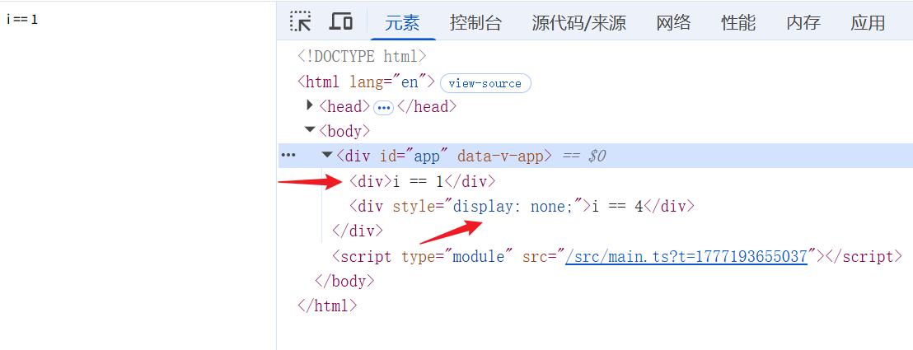
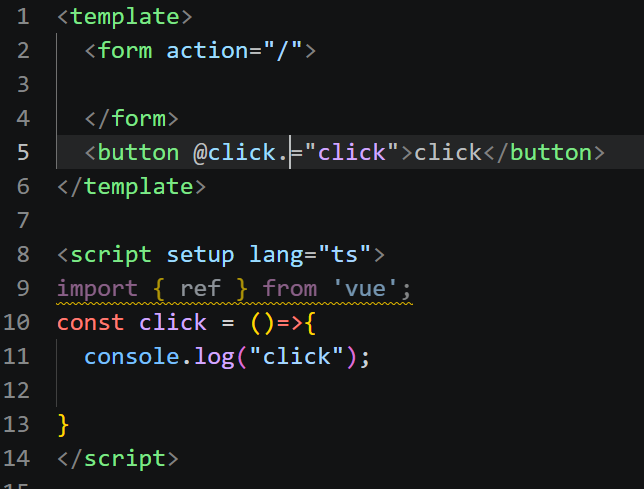

# Vue模板语法和指令

## Vue模板语法

vue的模板语法就是{{}} 两个大括号。我第一时间想到的是js里面的 **${}** 就是你写字符串的时候可以把变量插进去的

```vue
<template>
  <div>
    {{ str }}
  </div>
</template>

<script setup lang="ts">
import { ref } from 'vue';
let str = "你们拿东西给我拿好了啊！cnm"
</script>

<style scoped>
</style>
```

页面上就会出现 **你们拿东西给我拿好了啊！cnm**

## Vue指令

Vue里面有很多指令，都是由v开头的

### v-text和v-html

v-text是用于绑定文本的，v-html可以用来绑定html富文本字符串

```vue
<template>
  <div v-text="str">
    
  </div>
  <div v-html="h">

  </div>
</template>

<script setup lang="ts">
import { ref, type Ref } from 'vue';
let str:string ="你们拿东西给我拿好了啊！cnm"

let h:string = "<h1>你们拿东西给我拿好了啊！cnm</h1>"

</script>

<style scoped>
</style>
```

用这个去试下，页面就会出来两段文字

### v-if v-if-else v-else v-show

这个的意思也很简单了，就是在这个指令里面写条件控制此元素的展现与否了。但是这里的v-if这一类和v-show还是有点区别

```vue
<template>
  <div v-if="i == 1 ">i == 1</div>
  <div v-else-if="i == 2">i == 2</div>
  <div v-else="i == 3">i == 3</div>

  <div v-show="i == 4">i == 4</div>
</template>

<script setup lang="ts">

let i = 1;

</script>

<style scoped>
</style>
```


没有满足条件的v-if这边和v-show这边都没有展示出来，但是是有明显区别的。
- v-if这一类的，如果没有满足条件，他不会把这个元素加载到dom树上
- v-show 使用的是css的display设置为none的做法，在视觉上隐藏了

### v-on用来给元素添加事件

v-on还可以简写成  @  。现在用个例子来看看：

```vue
<template>
  <button @click="add">add</button>
</template>
<script setup lang="ts">
let i = 1;
const add = ()=>{
  i++;
  console.log(i);
  
}
</script>
<style scoped>
</style>
```

每次点击都可以看到控制台的i在增加

#### 修饰符
js里面不是会有阻止冒泡事件之类的嘛，vue里面也能实现

form表单有个默认提交，我们这样设置一下，就没有了
```vue
<template>
  <form action="/">
    <button @click.="click">click</button>
  </form>
  
</template>

<script setup lang="ts">
import { ref } from 'vue';
const click = ()=>{
  console.log("click");
  
}
</script>

<style scoped>
</style>
```

### v-bing绑定你的元素属性

这里用一个小案例来实现一下
```vue
<template>
  <div :class="active ? 'active' : ''"></div>
</template>

<script setup lang="ts">
import { ref } from 'vue';

let active  = true

</script>

<style scoped>
div {
  width: 100px;
  height: 100px;
  border: 1px solid black;
}
.active {
  background-color: pink;
}
</style>
```
这样就给这个div背景颜色改变了，将active改成false，就没有颜色了

### v-for和key

会有这样的场景，有很多个数据需要绘制，但是其实他们的结构都是一样的存在一个同类型的数组里面，这里可以用v-for来遍历然后绘制在页面上
```vue
<template>
  <ul>
    <li v-for="item in arr" :key="item.id">{{ item }}</li>
  </ul>
</template>

<script setup lang="ts">
import { ref } from 'vue';

let arr = [
  {
    name:1,
    id:1
  },
  {
    name:2,
    id:2
  },
  {
    name:3,
    id:3
  },
  {
    name:4,
    id:4
  },
]
</script>

<style scoped>
</style>
```

**提高你的性能！！！**

- v-for 的默认方式是尝试就地更新元素而不移动它们。要强制其重新排序元素，你需要用特殊 attribute key 来提供一个排序提示！

这个key是必要的，当你使用 v-for 渲染列表时，Vue 需要知道每个节点的“身份”，以便在数据变化时：

- 复用已有 DOM 节点（避免不必要的创建/销毁）
- 保持组件状态（如 input 输入框内容、子组件内部状态）
- 高效执行 Diff 算法
  
假设原列表为 [A(id=1), B(id=2)]，更新后变为 [B(id=2), C(id=3)]：

- Vue 通过 key 识别出：

    - id=1 被移除 → 删除 A 的 DOM
    - id=2 位置移动 → 移动 B 的 DOM（不重建）
    - id=3 新增 → 创建 C 的 DOM


### v-model双向绑定
在视图上的修改，也会影响到数据，就实现了双向绑定
```vue
<template>
  <div>{{ msg }}</div>
  <input v-model="msg" type="text">
</template>

<script setup lang="ts">
import { ref } from 'vue';
let msg = ref("hello")
</script>

<style scoped>
</style>
```
这就是一个简单的例子，在input上修改，会修改msg，然后由于msg是ref响应式的，所以div里面的内容也会随着更改

### v-once静态？只加载一次
```vue
<template>
  <span v-once>这个值永远不会变 {{ msg }}</span>
  <div>{{ msg }}</div>
  <input type="text" v-model="msg">
</template>

<script setup lang="ts">
import { ref } from 'vue';
let msg =ref("hello")

</script>

<style scoped>
</style>
```

只加载一次！
