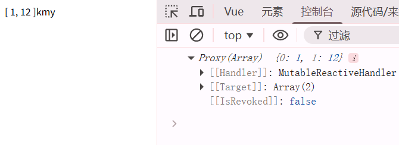
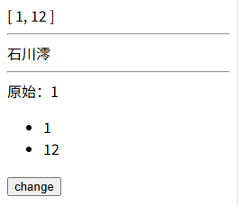

# PINIA
快乐的小菠萝，是一个集中式的响应式的管理数据的工具，由state、getters、actions组成

## 安装 npm install pinia
1. npm install pinia
2. 在main.ts里面注册：

 ```ts
import { createApp } from 'vue'
import App from './App.vue'
import { createPinia } from 'pinia' //引入

const store = createPinia();  //创建store
createApp(App).use(store).mount('#app')  //注册
```

3. 定义store
getters相当于computed，actions相当于function就是调用方法
```ts
import { defineStore } from "pinia";

export const useMainStore = defineStore('main',{
    state:()=>{
        return {
            list:[1,12],
            name:"kmy"
        }
    },
    getters:{

    },
    actions:{
        
    }
    
})
```

使用：因为store相当于一个reactive对象，所以不需要用value获取值
```vue
<template>
  <div>
    <span>{{ main.list }}</span>
    <span>{{ main.name }}</span>
  </div>
</template>

<script setup lang="ts">
import { ref } from 'vue';
import { useMainStore } from './store';
const main = useMainStore();
console.log(main.list);

</script>

<style scoped>
</style>
```



修改state属性的值：新增一个count计数属性
1. 直接修改 
```ts
<template>
  <div>
    <span>{{ main.list }}</span>
    <hr>
    <span>{{ main.name }}</span>
    <hr>
    <span>{{ main.count }}</span>
  </div>
  <button @click="change">change</button>
</template>

<script setup lang="ts">
import { ref } from 'vue';
import { useMainStore } from './store';
const main = useMainStore();
console.log(main.list);

const change = ()=>{
  main.count++
}
</script>

<style scoped>
</style>
```


2. $patch两种写法，一种传递对象，一种传递回调函数回调函数里面state作为参数
```ts
const change = ()=>{
  main.$patch({
    name:"看风景人",
    count:3
  })
}
```

```ts
const change = (()=>{
  main.$patch((state)=>{
    state.count++;
    state.name = "666"
  })
})
```

3. $state
```ts
main.$state = {
    list:[8,9,0],  //这个方式赋值完后还是响应式的
    name:"桃乃木香奈",
    count:4
  }
```

4. actions定义方法
```ts

//actions里面定义方法
actions:{
        listPush(num:number){
            this.list.push(num)
        }
    }

//使用的时候用main直接调用
main.listPush(5)
```

## state的解构

直接解构会丢失响应式，可以使用storeToRef来解构，这样会有响应式
```ts
let  { list, name, count } = main

const change = () => {
  main.count++
  console.log(count,main.count);
  
}
```

改变一下：
```ts
let  { list, name, count } = storeToRefs(main)
const change = () => {
  count.value++
  main.count++
  console.log(count,main.count);
  
}
```
这样就有响应式了,不管是直接拿main的值改变，还是解构的值改变，都是响应式

原理：storeToRefs先将store对象解构然后toraws变成一个普通对象，再将state里面的属性重新toRefs

## actions和getters
actions里面写的是设置数据的方法，比如你要改变数据，最好是在这里写

getters是外面获取数据的，一般用来返回数据。是不是很像java类里面的setter和getter？

### actions

比如这里来个修改名字的，而且是异步的，调用其他函数的。actions里面异步用async和await接收就行了
```ts
import { defineStore } from "pinia";

const setName = ()=>{
    return new Promise<string>((resolve, reject) => {
        setTimeout(()=>{
            resolve('石川澪')
        },3000)
    })
}

export const useMainStore = defineStore('main',{
    state:()=>{
        return {
            list:[1,12],
            name:"kmy",
            count:1
        }
    },
    getters:{

    },
    actions:{
        async changeName(){
            const name = await setName();
            this.name = name
        }
    }
    
})
```
这里最好写传统函数啊，因为箭头函数没有this。没有问题

你也可以搞个形参传进去，这样更灵活

### getters
```ts
getters:{
        getName():String{
            return this.name
        }
    },
```
getters里面这样写，外面调用的时候把这个当成一个属性直接用就行了

```vue
<span>{{ main.getName }}</span>
console.log(main.getName);
```

而且这个也是响应式的，点击change，会发现这个也是改变了的

