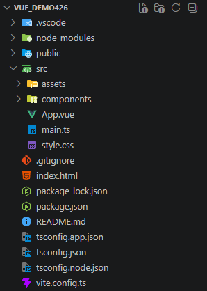
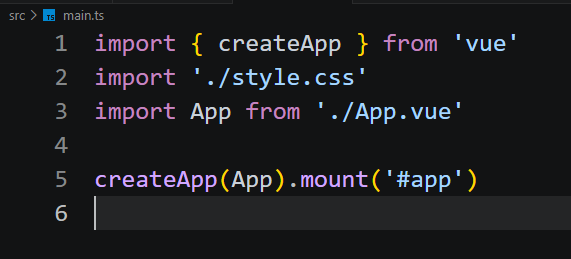
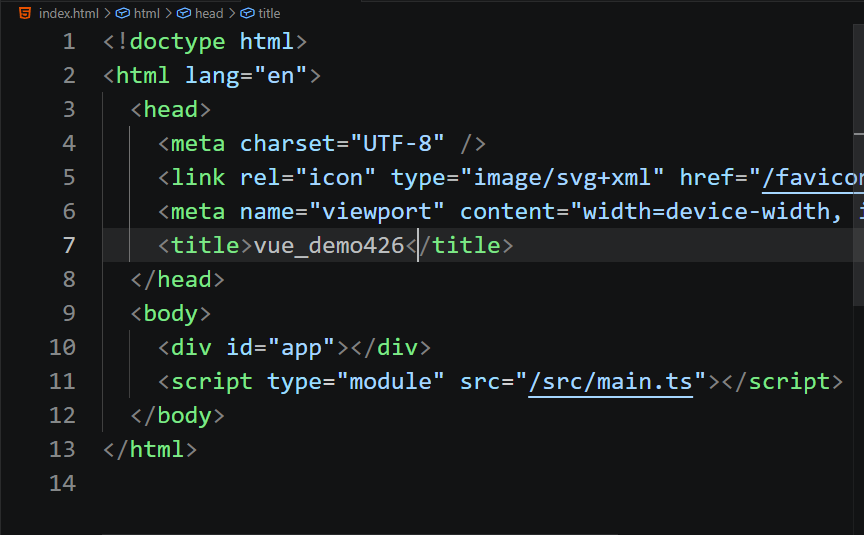
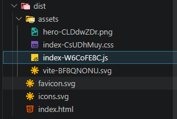
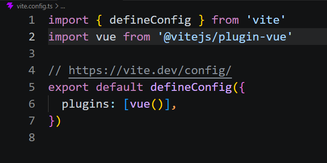
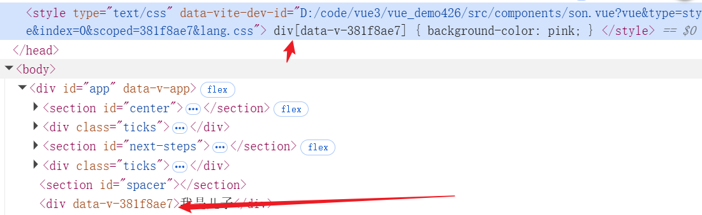

# Vue

初识Vue，我认为的Vue就是一个网页响应式的写法，数据和视图绑定了，直接更改数据而不需要再去更改视图。后面发现错了，知道了有组件这个东西，就认为Vue就是把页面改成组件拼接的写法。然而这也是不对的

## Vue的目录结构



- assets下面是放一些资源的比如css样式
- components是放组件的文件夹
- App.vue是整个Vue的根组件
- main.ts就是最重要的主js文件，里面包含了样式引入，App这个根组件的创建和挂载，最后html来引入main.ts

main.ts:


html:



## Vue与工程化

诶，这个是不是和之前说的一个东西很想吗，对啊，就是前端工程化的打包工具这里。在前端工程化里面，所有的资源都是先引入到一个js文件里面，然后再用script标签挂载html上


那我们试着打包一下，看看输出的dist：


首先ts文件被转化并且打包成了js文件，然后就是图像和css还有html文件都一起被打包了进来。这说明vue是给我们做了配置并且提前配置了很多loader的

说明这个Vue3还是再这个打包工具的基础上去构建的

那我们来看看这个**vite.config.ts** 看看里面的配置

啊，怎么只有一个插件Vue？


这个就是vite已经把ts转译、css、图片加载这些东西内置了，而Vue只需要处理.Vue文件的东西了

## Vue文件

```Vue
<template>
    <div>我是儿子</div>
</template>

<script setup lang="ts">

</script>

<style scoped>
</style>
```

这就是一个Vue文件的模板
- **template** 相当于html，里面是放子组件或者dom元素的地方
- **script** 就是写js的地方，这个setup就是一个语法糖还是什么
- **style** 就是写css样式的地方，注意这个**scoped** 加上这个之后，表示这个样式只在当前组件生效

**scoped**的原理：
加上**scoped**之后，编译的时候，会给这个选择器加上一个属性选择器 [data-v-hash] 然后本组件上的标签也会自动加上这个属性。其他组件的没有这个属性，自然就不能被选择到了
