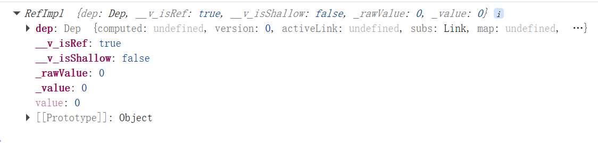
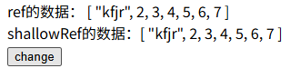

# 简单的响应式

## ref家族


### ref
使用ref包裹一个数据，使它成为响应式的

```vue
<template>
  <button @click="count++">{{ count }}</button>
</template>

<script setup lang="ts">
import { ref } from 'vue';

const count = ref(0)
</script>

<style scoped>
</style>
```

点击按钮，这个count会增加。嘶为啥这个count明明是const定义的，但是数据还能改变呢？我们来打印看下

可以看到这个count并不是简单的 0 ，而是一个对象的形式，这说明ref包裹数据之后返回的是一个ref对象，在ts/js代码中你需要 count.value才能操作这个数据。而在template中使用不需要加上value
- 在模板中使用 ref 时，我们不需要附加 .value。为了方便起见，当在模板中使用时，ref 会自动解包 (有一些注意事项)。

### shallowRef
shallowRef算是ref的一个浅层化？当我们想要对一个有多层结构的引用型数据类型进行响应式使用，ref可以检测到这个数据的所有属性然后做出响应式，而shallowRef只能对它浅层变化做到响应式

我们用这段代码做一个示例：
```vue
<template> 
  <div>{{ count }}</div>
  <button @click="change">change</button>
</template>

<script setup lang="ts">
import { ref, shallowRef, triggerRef } from 'vue';

const count= ref<any[]>([1,2,3,4,5,6,7])

const change = ()=>{
  count.value[0] = "kfjr"
}
console.log(count);

</script>

<style scoped>
</style>
```

尝试着改用shallowRef，发现，这个是改不了的。这个就和vue的这个响应式有关了,但是你试着打印一下这个count，会发现在控制台里面他是变了的

我们接着来看下面一个代码：

```vue
<template> 
  <div>ref的数据： {{ count }}</div>
  <div>shallowRef的数据：{{ count2 }}</div>
  <button @click="change">change</button>
</template>

<script setup lang="ts">
import { ref, shallowRef, triggerRef } from 'vue';

const count= ref<any[]>([1,2,3,4,5,6,7])
const count2= shallowRef<any[]>([1,2,3,4,5,6,7])


const change = ()=>{
  count.value[0] = "kfjr"
  count2.value[0] = "kfjr"
}
console.log(count);
console.log(count2);

</script>

<style scoped>
</style>
```
按理来说，点击按钮之后，一个会变一个不会变但是这里会发现两个都改变了

这就说明这和ref里面的一些机制有关，这导致shallowRef也受到了影响

vue中的一个响应式数据，在第一次渲染的时候，vue会 **跟踪track()** 它，一旦它发生变化就会 **触发trigger()** 一次更新
这里，shallowRef放弃了对深层数据的trigger

### triggerRef
用上这个，可以强制更新你的dom，shallowRef设置的数据也会被更新
```ts
const change = ()=>{
  count2.value[0] = "kfjr"
  triggerRef(count2)
}
```

把count先拿开，加上这个，会发现，count2虽然是shallowRef，但是现在也会有深层响应式了，这其实是它被提醒要更新了而已

### customRef

可以用这个然后借助vue的一些小工具，我们自己定义一个

```vue
<template>
  <div>
    {{ msg }}
  </div>
  <button @click="change">change</button>
</template>

<script setup lang="ts">
import { ref, customRef } from 'vue';

const msg = myRef('hello')

function myRef(value: any) {
  let timer: any
  return customRef((track, trriger) => {
    return {
      get() {
        track()
        return value
      },
      set(newVal) {
        clearTimeout(timer)
        timer = setTimeout(() => {
          console.log("触发了set" + newVal);

          value = newVal  //每次点击会把上次的这个定时任务清掉，实现了这个防抖
          trriger()
        }, 500)

      }
    }

  })
}

const change = () => {
  msg.value = 111
}
</script>

<style scoped></style>
```

#### track, trriger 这两个函数是干嘛的？

在 vue 中有个依赖系统，专门管理响应式数据， **track** 呢负责收集这些数据 “vue，这个叫 **msg** 的是响应式的”。 **trriger** 呢负责提醒 vue 干活 “ vue，赶紧工作”然后vue就会对响应式数据进行一系列操作，比如重新渲染有响应式数据的dom

- 少了 **track** ，vue就没有收集到这个依赖
- 少了 **trriger**，没东西提醒vue，就不会执行更新之类的

## reactive

reactive可以看作是ref的 **引用数据类型** 版，reactive只支持引用数据类型的响应式，就是数组、对象这一类。如果你传普通的数据类型是会报错的

我们来看一个有趣的：

```ts
let person = reactive<number[]>([])
setTimeout(() => {
  person = [1, 2, 3]
  console.log(person);
  
},1000)
```

这个会丢失响应式为啥？因为开始person指向的是一个reactive对象的地址，后面你把一个普通数组丢给他，指向改变了，那原来的reactive就没了啊

再来看一个有意思的 有关于shallowRef的
```vue

<template>
  <div>
    <div>{{ state }}</div>
    <button @click="change1">test1</button>
    <button @click="change2">test2</button>
  </div>
</template>
 
<script setup lang="ts">
import { shallowReactive } from 'vue'
 
 
const obj = {
  a: 1,
  first: {
    b: 2,
    second: {
      c: 3
    }
  }
}
 
const state = shallowReactive(obj)
 
function change1() {
  state.a = 7
}
function change2() {
  state.first.b = 8
  state.first.second.c = 9
  console.log(state);
}
 
</script> 
 
<style>
</style>
```

如果你先点按钮1，再点按钮2，你会发现只有属性a会变，而b、c的值虽然变了但是视图上是没有变化的。反之就会发现，最后点击按钮1之后，a、b、c试图都会更新

- 为啥，还是因为track和trriger嘛，shallowReactive只是在监听的属性比较深层的时候没有调用trriger，最后你修改浅层的a，调用trriger，就一道把之前依赖收集到的b、c一起更新了