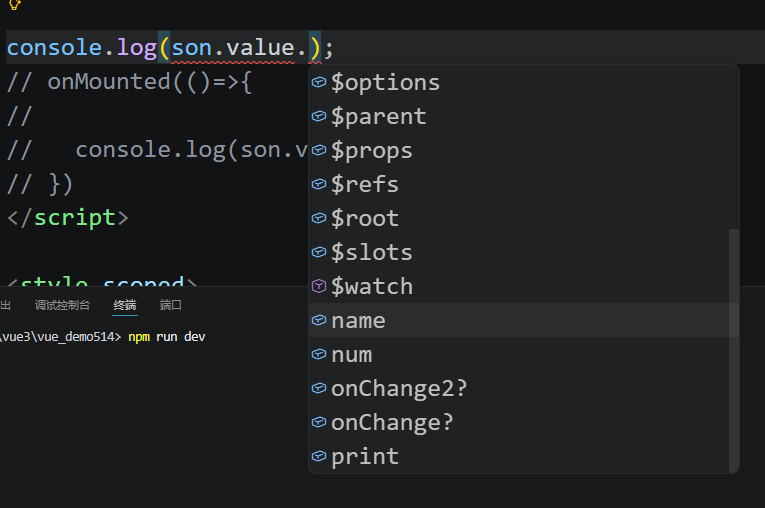
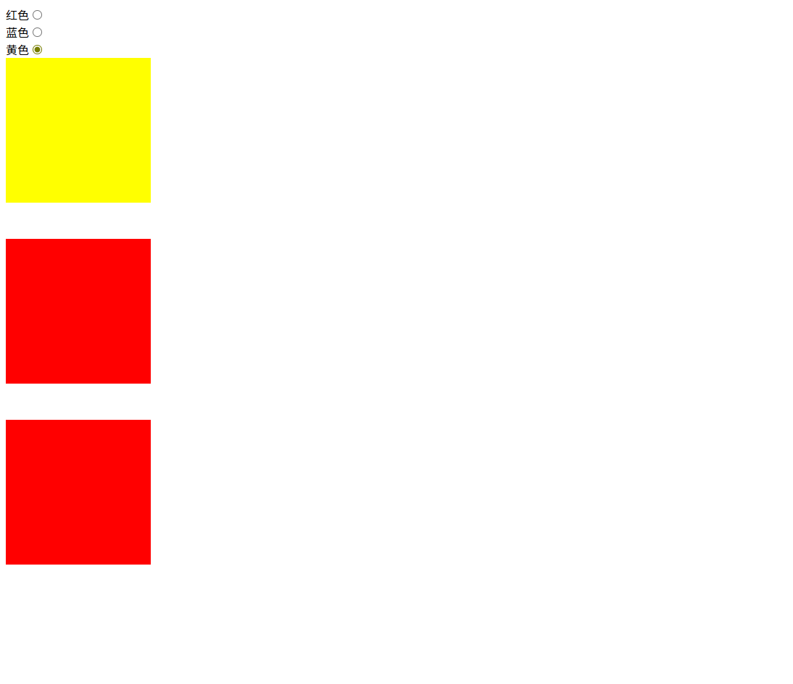
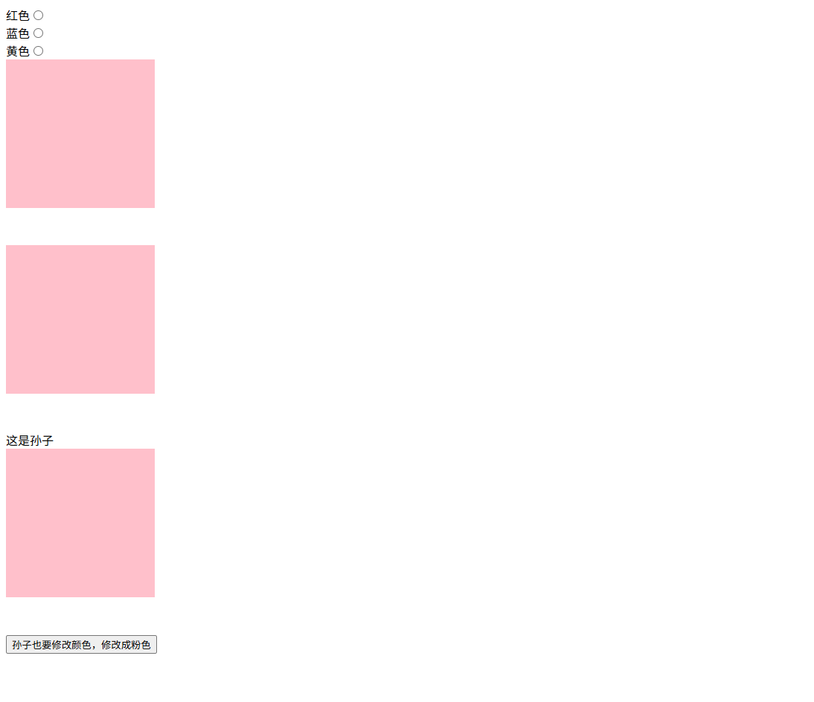
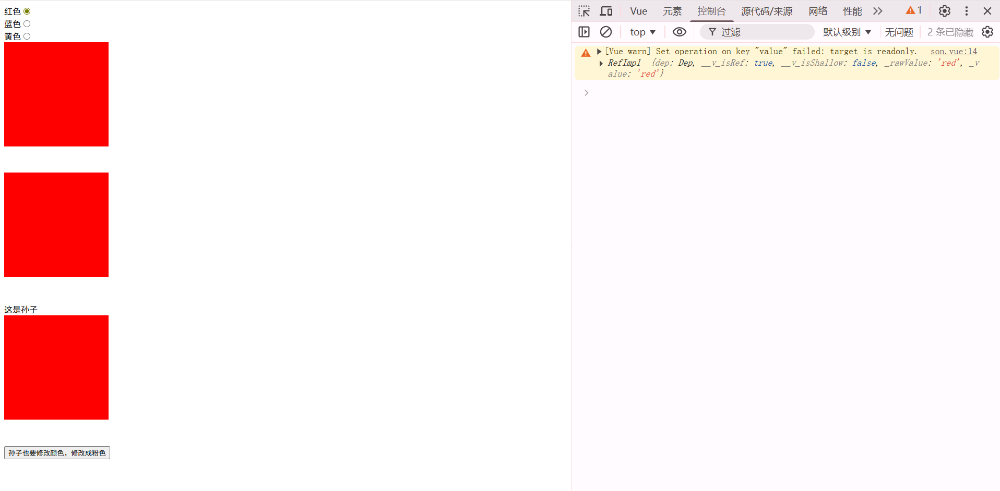
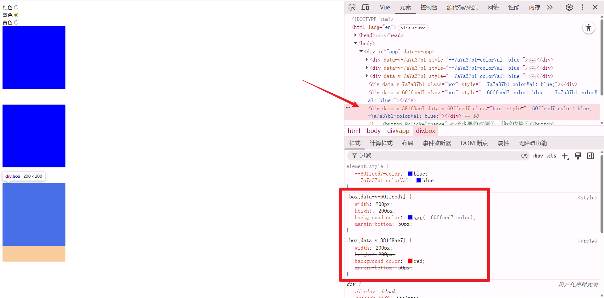

# 组件间传递参数

经常会有需要传递数据的场景

## 1、defineprops/props 父向子传数据

父要传递参数，先定义一个标识符，这里使用msg、:list、:user
天哪我是蠢比，msg是的这里直接传递字符串了，：list冒号动态绑定才是传递变量过去了

```vue
<Child msg="我是父组件传的字符串" 
      :list="['Vue3', 'React', 'Angular']" 
      :user="{ name: '张三', age: 20 }"
    ></Child>
```

子：使用defineprops接收,使用props调用访问数据，props是只读的

```js

const props = defineProps<{msg:string,
    list:Array<string>,
    user:{name:string,age:number} }>()

// 直接使用 props.xxx 访问数据
console.log(props.msg)

```

## 2、defineEmits/emit 子向父传递数据

子使用defineEmits定义好发送的数据和标识符，然后用emits发送

```ts
const emit = defineEmits(['audioURL'])

const send = async (sessionId: number) => {
    const message = text.value;
    text.value = ''; 
    const url = await useSend(sessionId,message);

    //触发的事件名，参数1、参数2......
    emit('audioURL',url)
}
```

父组件使用@+标识符接收，然后在定义的函数里面获取

```ts
<ChatInput v-model="sessionId" @audioURL="handleChild"></ChatInput>
    

const handleChild = (audioURL: string) => {
    url.value = audioURL
}
```

### 想一次性传递多个参数呢？

那么子在传递数据的时候直接加上就行了
```vue
<template>
    <button @click="send">点击我</button>
</template>

<script setup lang="ts">
import { ref } from 'vue';

const emit = defineEmits(['change']);

const send = () => {
    emit('change', '这是子组件传递的数据','这是子组件传递的数据2');
}

</script>

<style scoped>
</style>
```

这个时候父可以根据有几个参数取设置接收函数的形参：
- 当然这里用可变参数也是可以的

```vue
<template>
  <Son @change="getData"></Son>
</template>

<script setup lang="ts">
import { ref } from 'vue';
import Son from './components/son.vue';

const getData = (...arr:string[])=>{
  console.log(arr);
  
}
</script>

<style scoped>
</style>
```

## defineExpose暴露方法和值

defineExpose可以把子组件的方法和值暴露给父组件

```vue
<template>
    <button @click="send">点击我</button>
</template>

<script setup lang="ts">
import { ref } from 'vue';

const num = 6;

const print = (str:string)=>{
    console.log(str);
    
}

defineExpose({
    name: '看风景人',
    num,
    print
})
</script>

<style scoped>
</style>
```

在父组件里面，可以在子组件上使用ref接收，然后使用

```vue
<template>
  <Son ref="son" @change="getData" @change2="getData2"></Son>
</template>

<script setup lang="ts">
import { onMounted, ref } from 'vue';
import Son from './components/son.vue';

const son = ref<InstanceType<typeof Son>>();

son.value?.print("我是个傻逼");

console.log(son.value?.name);
console.log(son.value?.num);

</script>

<style scoped>
</style>
```
怎么定义接收到的数据类型呢？需要使用InstanceType取获取，它接收一个泛型，然后可以用typeof取读取子组件的类型。也可以不写类型，但是会没有这样的类型提示：


此时会发现打印的是undefined，而且函数也没有被调用。这是因为执行到这里的时候，子组件还没加载出来，使用钩子函数调用一下就行了

```ts
onMounted(()=>{
  console.log(son.value?.name);
  console.log(son.value?.num);
  son.value?.print("我是个傻逼");
})
```


## v-model 父子之间通信

v-model实现了一种双向通信，或者说把数据让两个组件共享了。比如说我这里的一个页面组件依赖着 sessionId 去判断自己是那个路由的，并且要靠 sessionId 去展示不同的内容。页面组件里面由 chatInput 输入框组件，chatInput也需要 sessionId 去确定输入的内容发向哪个pinia里面定义的数组，然后让页面展示。随着路由的切换，sessionId也在切换
所以需要一个响应式的发送方式

父：
```ts
<ChatInput v-model="sessionId" @audioURL="handleChild"></ChatInput>
```

子怎么接收使用呢：defineModel
```ts
const sessionId = defineModel<number>({required:true});//number类型，且是必传的
```


不过我这里好像用错了，v-model实现的是双向绑定，而我这里实际向要的是响应式了


实际上我用到的，应该就是这个简化了传递数据的操作，我这里有个实例是：父组件有个isShow控制一个组件的展示，然后子组件里面也能修改这个isShow，所以就用v-model了


同时v-model支持传递多个值，模板是

- v-model:键="值"

父组件：
```ts

<Topbar class="Topbar" v-model:isTopBarShow="isTopBarShow" v-model:isShow="isShow" @mouseenter="isTopBarShow = true" @mouseleave="isTopBarShow = false"></Topbar>

const isShow = ref(true)
```


子：这样直接上手就能用了

```ts
const isTopBarShow = defineModel<boolean>('isTopBarShow')
const isShow = defineModel<boolean>('isShow')
```

## provide和inject实现根组件向子孙传参

如果使用prop来传参，爷爷的数据要经过两次props传向孙子，我们可以用provide和inject来实现


图上依次是爷爷爸爸儿子，效果就是爷爷定义的colorVal改变时可以一同改变爸爸和儿子的

```vue
<template>
  <div>
    <span>红色</span>
    <input type="radio" v-model="colorVal" value="red">
  </div>
  <div>
    <span>蓝色</span>
    <input type="radio" v-model="colorVal" value="blue">
  </div>
  <div>
    <span>黄色</span>
    <input type="radio" v-model="colorVal" value="yellow">
  </div>
  
  <div class="box"></div>
  <Father></Father>
</template>

<script setup lang="ts">
import { provide, ref } from 'vue';
import Father from './components/father.vue';

const colorVal = ref<string>('red');
provide('color',colorVal);
</script>

<style scoped>
.box {
  width: 200px;
  height: 200px;
  background-color: v-bind(colorVal);
  margin-bottom: 50px;

}
</style>
```

vue的css里面也能用v-bind(colorVal)模板语法绑定变量


父里面使用inject取拿到这个东西

```vue
<template>
    <div class="box"></div>
    <Son></Son>
</template>

<script setup lang="ts">
import { ref,inject } from 'vue';
import type {Ref} from 'vue';
import Son from './son.vue';
const color = inject<Ref<string>>('color')

</script>

<style scoped>
.box {
    width: 200px;
  height: 200px;
  background-color: v-bind(color);
  margin-bottom: 50px;
}
</style>
```

孙子也一样，不过我们想着在孙子里面取修改这个响应式的color可不可以呢？

```vue
<template>
    <span>这是孙子</span>
    <div class="box"></div>
    <button @click="change">孙子也要修改颜色，修改成粉色</button>

</template>

<script setup lang="ts">
import { inject, ref } from 'vue';
import type { Ref } from 'vue'
const color = inject<Ref<string>>('color');

const change = () => {
    color!.value = 'pink'
}
</script>

<style scoped>
.box {
    width: 200px;
    height: 200px;
    background-color: v-bind(color);
    margin-bottom: 50px;
}
</style>
```

我们成功了！！！


如果你不想让你的子孙修改这个值，可以在provide的时候加上readonly,就像这样做：

```ts
provide('color',readonly(colorVal));
```




## scoped和样式穿透

这里只讲碰到的问题，注意看我们这里的盒子类名都是box,而且祖孙三代都是soped防止了样式穿透的。尝试一下把孙子的html改成只有一个div  `<div class="box"></div>`然后再把孙子的背景颜色固定成red。再点击切换颜色会发生神奇的事情，孙子的颜色页跟着改变了

而且可以看到这里孙子本来被分到的data-v-381被划去了。

- 例外情况：子组件的根元素会继承父组件的scoped样式。如果子组件的模板只有一个根元素，父组件的scoped样式会作用于这个根元素（但仅限于根元素）。


