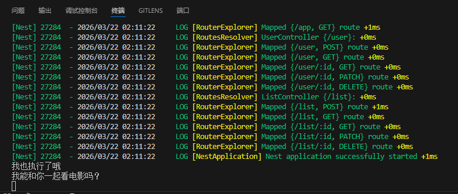
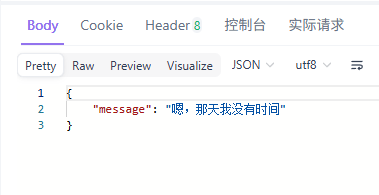

# middleware

middleware是中间件，中间件可以在接收到请求的时候对请求进行处理，比如说看看是不是满足一些条件。
中间件的组成：一般是使用use方法，方法里面需要传入 **(req,res,next)** 也就是请求体、响应体、next函数。next函数用来将控制传给下一个中间件函数

- 有三种中间件：依赖注入中间件、全局中间件、其他中间件
  
## 依赖注入中间件

可以创建一个类把它暴露出去当成可以调用的中间件
* 有个挺好的，如果不知道有那些参数和方法可以点进接口里查看
- Logger
  
```ts

import { Injectable, NestMiddleware } from "@nestjs/common";
import {NextFunction, Request,Response} from "express"


@Injectable()
export class Logger implements NestMiddleware {
    use(req: Request, res: Response, next: NextFunction) {
        console.log('我能和你一起看电影吗？')
        // res.send('不好，我被拦截了')
        next();
    }
}

```

Logger这个类是对**NestMiddleware** 这个接口的实现，里面调用use方法然后去处理请求。
把这个类标识成可被注入的

现在我们在user这个模块里给中间件导入

```ts

export class UserModule implements NestModule{ 
    configure(consumer: MiddlewareConsumer) {
      // consumer.apply(Logger).forRoutes('user')
      consumer.apply(Logger).forRoutes({path:'user',method:RequestMethod.POST})  
      // consumer.apply(Logger).forRoutes(UserController)  
    }
}


```

就讲讲这三种有什么区别吧
- `consumer.apply(Logger).forRoutes('user')` 表示对user这个路由进行中间件处理。这里我们使用`http://localhost:3000/user/123`和`http://localhost:3000/user` 可以看到两个 *我能和你一起看电影吗？*。而使用/list去是没有的，因为没有使用中间件嘛

- `consumer.apply(Logger).forRoutes({path:'user',method:RequestMethod.POST})` 这个是使用特定的请求方法拦截，比如这里就是对post方法进行拦截

- `consumer.apply(Logger).forRoutes(UserController)` 拦截UserController所有的方法


## 全局中间件

可以在main里面设置这个中间件,是定义一个函数

```ts
//可以做一个白名单的效果

const whiteList = ['/list','/user']

//全局中间件
function MiddleWareAll (req:Request,res:Response,next:NextFunction){
  // console.log(req.originalUrl);
  if(whiteList.includes(req.originalUrl)){
    console.log('我也执行了哦');
    next()
  }else{
    res.send({
      message:'嗯，那天我没有时间'
    })
  }
  
}
```

然后在起服务的函数里面调用它

```ts

async function bootstrap() {
  const app = await NestFactory.create(AppModule,{cors:true});
//   app.use(cors())
  app.use(MiddleWareAll) //注册一下，自己会调用的
  await app.listen(process.env.PORT ?? 3000);
}
```

还记的之前设置了依赖注入的中间件吗，这两个不会冲突，会依次执行

- 注意这个注册要在监听服务之前




😭😭😭😭😭😭

## 其他中间件

比如说跨域处理的cors 导入一下直接注册就好了，不过现在nestjs提供了直接解决跨域的，就是在创建服务的时候设置一下就行了

```ts
const app = await NestFactory.create(AppModule,{cors:true});
```