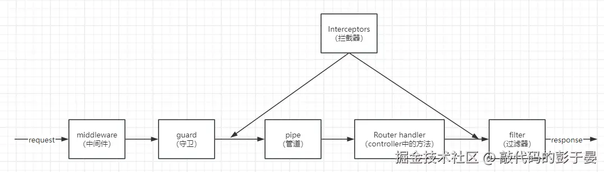
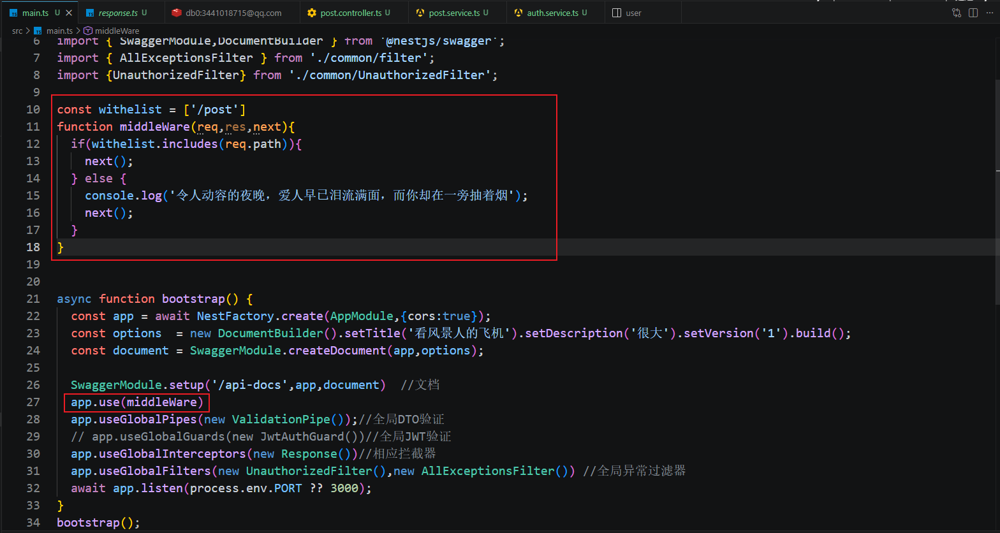
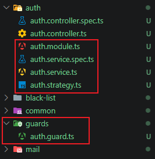
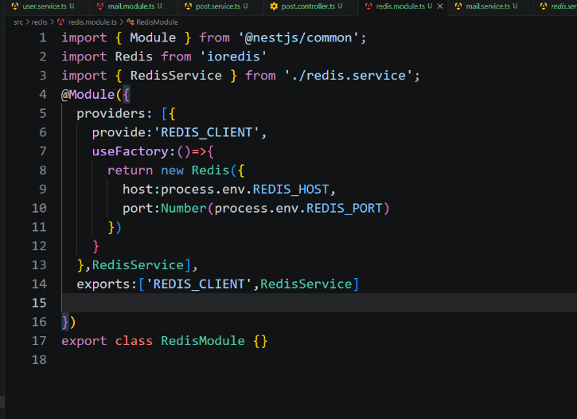
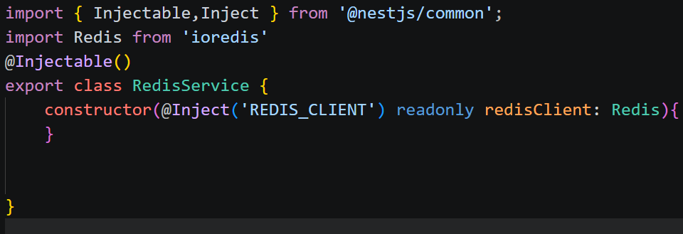
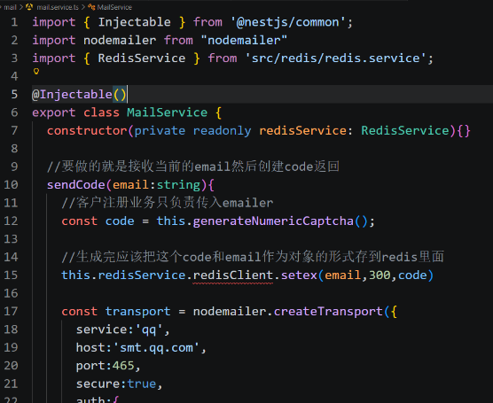

# 简单的小综合

- nestjs作为服务端框架来提供接口和各种验证等
- prisma连接nestjs框架和mysql，提供便利的服务
- nodemail提供简单的发送邮件的服务
- redis用来存验证码，可以模拟过期
- JWT用来提供简单的token接口验证
  
现在使用的模块，都要意识到这个模块是用来干什么的，可以解决什么问题
这个小例子的思路：用户使用邮箱注册，使用nodemailer给注册用到的邮箱发送动态验证码，生成验证码的同时存到redis里面用来后续的验证。成功注册之后，把用户的信息存到mysql里面，同时用这些信息生成token返回给前端，之后的一些接口的访问需要携带token。为了一点点安全（我也不知道实际会不会有效果😋），给验证token的管道加了个黑名单，当前用户退出登录之后，就把他的token存到黑名单里面不让使用了

## nestjs里面的一个请求的生命周期

可以看到依次是：
middleware->guard->req interceptors->pipe->controller->res interceptors->filter

### middleware中间件
中间件是用来预处理的，在拿到请求之后，你可以进行一些日志的打印这些事情，同时还有一些全局cors的跨域可以使用，这里我没有很深刻的体会到它的作用，所以就浅浅的把自己的例子拿来展示一下

这里是进行了一个类似白名单的操作，如果你的接口不是post的话，那就打印句子

- 跨域的问题，现在nestjs提供了解决跨域的方法

```ts
const app = await NestFactory.create(AppModule,{cors:true});
```

直接加上 **{cors:true}** 就行了

### guard守卫
守卫就相当于是一个给你的请求进行授权的角色，请求到这一步的时候，guard会对请求进行判断，有没有token？token合不合guard的规范。合格就通过

```ts
import { ExecutionContext, Injectable,UnauthorizedException } from "@nestjs/common";
import { AuthGuard } from "@nestjs/passport";
import { Observable } from "rxjs";
import { BlackListService } from "../black-list/black-list.service";


@Injectable()
export class JwtAuthGuard extends AuthGuard('jwt') {
    private wihteList = ['/user/login','/user/register','/user/captcha'];//白名单，放行不需要验证的接口
    constructor(private readonly blackListService: BlackListService){
        super();
    }

    //这个函数是用来判断当前请求是否需要进行身份验证的，如果请求的URL在白名单中，就直接放行，否则就调用父类的canActivate方法来验证用户的token是否合法
    canActivate(context: ExecutionContext): boolean | Promise<boolean> | Observable<boolean> {
        const req = context.switchToHttp().getRequest();

        const token = req.headers.authorization?.split(' ')[1];
        if(token && this.blackListService.has(token)){
            throw new UnauthorizedException('Token has been revoked');//如果token在黑名单中，就拒绝访问
        }
        if(this.wihteList.includes(req.url)){
            return true;
        }
        return super.canActivate(context);//这是给AuthGuard放行，也就是调用AuthGuard的canActivate方法，来验证用户的token是否合法，如果合法就放行，否则就拒绝访问
    }
}


//守卫就是你自己设置对应的条件，看要不要调用验证函数
```

- **canActivate**函数：这个函数就是用来验证合不合法，函数内部返回的是true就是放行
- **return super.canActivate(context)** ：这里就是交由父类的方法去判断了

### pipe管道

嘶，这里好像，你直接使用dto也能验证,这样注册一下就好了

```ts
app.useGlobalPipes(new ValidationPipe());//全局DTO验证
```

### controller

这个就是设置路由对应的方法,比如user和post对应的create和update

### res interceptors响应拦截器

响应拦截器是用来对服务端向前端返回的信息进行一些处理的，可以处理格式等内容

```ts
import { Injectable, NestInterceptor,CallHandler } from "@nestjs/common";
import {map} from "rxjs/operators"
import { Observable } from "rxjs";
import { ExecutionContext } from "@nestjs/common"; 

@Injectable()
export class Response implements NestInterceptor{
    intercept(context: ExecutionContext, next: CallHandler<any>):Observable<any>{
        //响应拦截器里面调用pipe管道进行数据处理
        return next.handle().pipe(map(data=>{
            return {
                data,
                status:0,
                success:true,
                message:"牛逼"
            }
        }))
    }
}
```

- 响应拦截器里面调用pipe管道进行数据处理


### filter过滤器

filter过滤器一般是用来捕获到异常的，就和then里面的catch一样，你可以设置多种过滤器。比如在这里我设置了两个。
- `AllExceptionsFilter` :用来处理所有的异常类型，通用的
- `UnauthorizedFilter`  :用来处理和token验证相关的异常

*AllExceptionsFilter*

```ts
import { ExceptionFilter,Catch,ArgumentsHost,HttpException } from "@nestjs/common";
import { Request,Response } from "express";

export class AllExceptionsFilter implements ExceptionFilter{
    catch(exception: HttpException, host: ArgumentsHost){

        const ctx = host.switchToHttp();
        const request = ctx.getRequest<Request>();//给这个函数传入两个类型
        const response = ctx.getResponse<Response>();


        const status = exception.getStatus();
        response.status(status).json({
            success:"失败了",
            timestamp:new Date().toISOString(),
            status,
            path:request.url,
            message:exception.message
        })

    }
}
```

*UnauthorizedFilter*
```ts
import { UnauthorizedException,Catch,ArgumentsHost,HttpException,ExceptionFilter  } from "@nestjs/common";
import { Request,Response } from "express";

@Catch(UnauthorizedException)
export class UnauthorizedFilter implements ExceptionFilter{
    catch(exception: UnauthorizedException, host: ArgumentsHost){
        const ctx = host.switchToHttp();
        const response = ctx.getResponse<Response>();
        const request = ctx.getRequest<Request>();
        const status = exception.getStatus();

        response.status(status).json({
            message:"认证失败，请重新登录",
            statusCode: status,
            timestamp: new Date().toISOString(),
            path: request.url
        });

    }
}
```


#### filter的注册

直接在main.ts里面引入然后注册，因为exports的是一个对象所以需要实例化

```ts
app.useGlobalFilters(new AllExceptionsFilter(),new UnauthorizedFilter())
```

- 注册的顺序：通用过滤器、特定错误的过滤器

这里我们不带token去访问一个需要验证的接口，这样注册返回的处理结果是

```json
{"message":"认证失败，请重新登录","statusCode":401,"timestamp":"2026-04-08T03:15:06.131Z","path":"/post"}
```


如果把顺序反转：

```json
{"success":"失败了","timestamp":"2026-04-08T03:13:43.501Z","status":401,"path":"/post","message":"Unauthorized"}
```


## JWT的一个流程
要使用JWT，需要先安装一下服务

```cmd
npm i --save @nestjs/jwt
npm i @nestjs/passport passport
npm i passport-jwt 
npm i @types/passport-jwt -D
```

他们的作用是：
1. 生成token
2. 验证流程骨架
3. 解析、验证 token
4. TS 类型提示

JWT的思路就是两步： 生成token，验证token。所以重要的有这几个地方

auth整个模块里面有service提供创建token的方法，然后有strategy提供验证。然后是守卫

*auth.service.ts*

```ts
import { Injectable } from '@nestjs/common';
import { JwtService } from '@nestjs/jwt';

@Injectable()
export class AuthService {
    constructor(private readonly jwtService: JwtService) {

    }
    //专门用来生成token
    async generateTokens(payload:{username:string,userid:number}){
        
        const token  = await this.jwtService.signAsync(payload,{
            secret:process.env.TOKEN_SECRET_KEY,
            expiresIn:'1d'
        });
        return token;
    }

}
```

*auth.strategy.ts*

```ts
import { PassportStrategy } from "@nestjs/passport";
import { Injectable } from "@nestjs/common";
import {ExtractJwt,Strategy} from "passport-jwt";


@Injectable()
export class JwtStrategy extends PassportStrategy(Strategy,'jwt'){ //靠这个jwt来和守卫对应上的
    constructor(){
        super({
            jwtFromRequest:ExtractJwt.fromAuthHeaderAsBearerToken(),
            ignoreExpiration:false,
            secretOrKey:process.env.TOKEN_SECRET_KEY! //加上！解决类型报错？
        });
    }
    async validate(payload: any){
        return payload //这里返回的东西就是req.user的内容
    }
}
```

*auth.guard.ts*

```ts
import { ExecutionContext, Injectable,UnauthorizedException } from "@nestjs/common";
import { AuthGuard } from "@nestjs/passport";
import { Observable } from "rxjs";
import { BlackListService } from "../black-list/black-list.service";


@Injectable()
export class JwtAuthGuard extends AuthGuard('jwt') {
    private wihteList = ['/user/login','/user/register','/user/captcha','/user/create'];//白名单，放行不需要验证的接口
    constructor(private readonly blackListService: BlackListService){
        super();
    }

    //这个函数是用来判断当前请求是否需要进行身份验证的，如果请求的URL在白名单中，就直接放行，否则就调用父类的canActivate方法来验证用户的token是否合法
    canActivate(context: ExecutionContext): boolean | Promise<boolean> | Observable<boolean> {
        const req = context.switchToHttp().getRequest();

        const token = req.headers.authorization?.split(' ')[1];
        if(token && this.blackListService.has(token)){
            throw new UnauthorizedException('Token has been revoked');//如果token在黑名单中，就拒绝访问
        }
        if(this.wihteList.includes(req.url)){
            return true;
        }
        return super.canActivate(context);//这是给AuthGuard放行，也就是调用AuthGuard的canActivate方法，来验证用户的token是否合法，如果合法就放行，否则就拒绝访问
    }
}


//守卫就是你自己设置对应的条件，看要不要调用验证函数
```

那这里就有疑问了，我这个strategy和这个守卫是怎么连到一起的？
- 流程应该是这样：守卫拿到请求之后，因为提前约定好了**jwt**作为标识 （AuthGuard('jwt')、PassportStrategy(Strategy,'jwt')），然后就会去使用我们提前写好的这个strategy判断

## 模块和提供

module里面包含着这样几个东西

1. providers 
2. imports
3. exports
4. controllers
   
1. providers：提供者。模块告诉nest，我的模块里面有这些服务，你帮我注册一下，这样别人使用的时候就能注入了
2. imports：当前模块需要注入其他模块的方法的时候，需要先import一下其他的模块
3. exports：这里面写的东西表示模块想要把这些服务暴露出来给别的模块用，没有暴露的就用不了
4. controllers：这就是自己写的那些接口

举个例子,这是auth的module，这里面的jwtStrategy不是想暴露出去的，如果你在别处使用这个，就会报错

```ts
@Module({
    imports:[
        PassportModule,
        JwtModule
    ],
    providers: [JwtStrategy,AuthService],
    exports:[AuthService] //导出AuthService，供其它模块使用
})
```

## Nest 自定义提供者

在使用redis的时候，发现有点问题，而且看起来挺复杂的。使用redis作为模块的时候我的想法就是，像prisma一样，搞一个redis的服务类然后暴露出去，这样其他类就能直接使用。感觉我写的很复杂
1. 首先是Redis的模块

由于nest没有redis的服务，所以我这里使用的是 `ioredis` 。nest也不会自动对redis实例化，需要这里使用useFactory函数给它注册一下（意思就是，其他的有些东西nest可以自动实例化，这里需要这样实例化一下，之后就能正常依赖注入了）。同时我们要给这个Redis实例起名，这里就叫 “REDIS_CLIENT” 之后在使用依赖注入的时候，用这个字符串就知道，要使用这个实例了

2. RedisService

这个意思就是注入名为“REDIS_CLIENT”这个Redis类的实例，在这里这个实例的变量名就叫redisClient吧

3. 在邮件服务里的应用

然后在我这个邮件服务中,就是注入RedisService的实例，名字叫redisService，然后这个redisService里面又有之前那个构造函数里面的redisClient，这个redisClient就是Redis了，然后就能使用服务


## app.useGlobalGuards(new JwtAuthGuard())和在provide里面{ provide: 'APP_GUARD', useClass: JwtAuthGuard }的区别

- 我的守卫里面想要加入黑名单功能，这样必须要在守卫里面注入黑名单的服务。但是发现app.useGlobalGuards(new JwtAuthGuard())注入不了啊
    - 一开始的想法：`app.useGlobalGuards(new JwtAuthGuard(new blackList()))`,全局注册的时候我这样搞一手，我不就可以直接在守卫里面手动注入了吗？但是发现这样会导致*blackList*在nestjs中实例化两次，那我存的数据都不在一个集合里面了，还怎么判断？
    - { provide: 'APP_GUARD', useClass: JwtAuthGuard }后面使用这个，发现这样就能自动注入了

官网是这样说的
**app.useGlobalGuards**（注册全局守卫）：全局守卫在整个应用中使用，适用于每个控制器和每个路由处理器。在依赖注入方面，从任何模块外部注册的全局守卫（如上例中的 useGlobalGuards()）无法注入依赖，因为这是在任何模块的上下文之外完成的。为了解决这个问题，你可以通过以下方式直接从任何模块设置守卫：{ provide: 'APP_GUARD', useClass: JwtAuthGuard }

这个意思应该是在模块的初始化之后才注册这个全局守卫？这个app.useGlobalGuards注册的太早或者太晚了，导致不能注入依赖