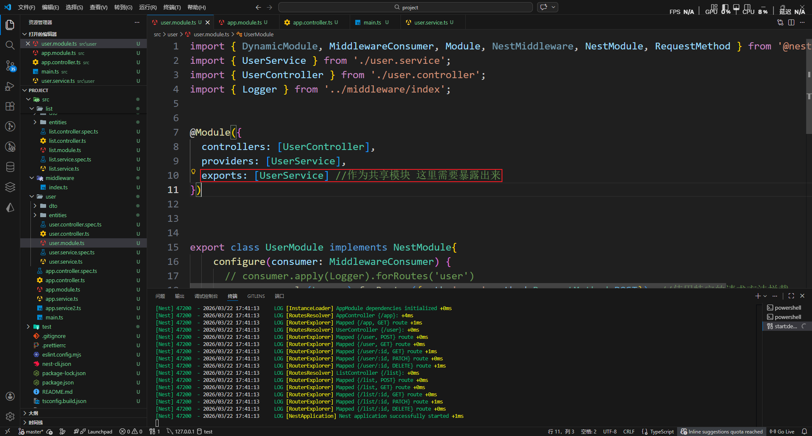
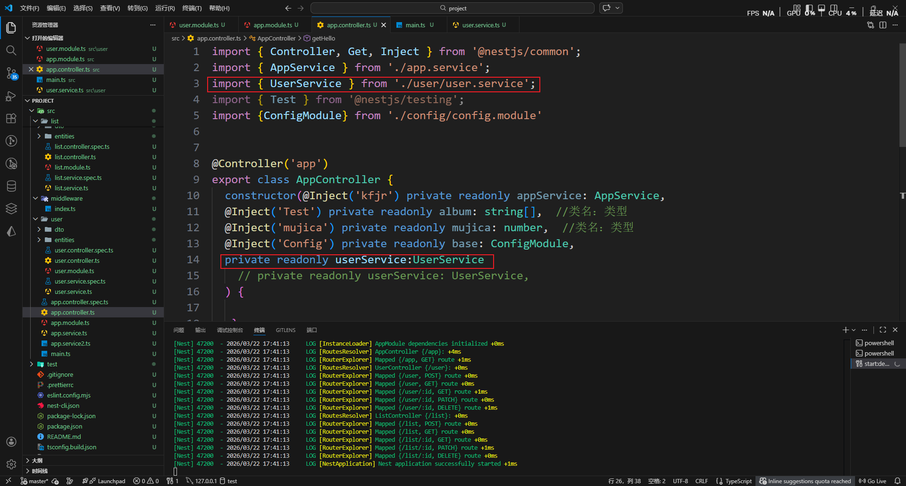
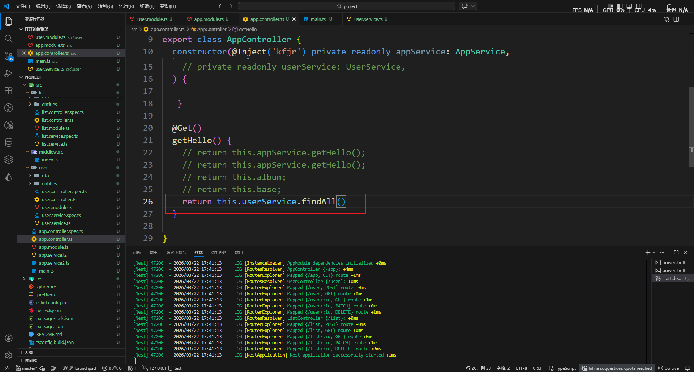

# 模块
模块可以看作是一个管理中枢，每一个业务逻辑都有属于自己的中枢部门来管理业务。同样的也会有根模块这种总的管理。CURD创建模板之后自动创建了模块，但是也有些其他的模块需要认识
1. 共享模块
2. 全局模块
3. 动态模块

## 共享模块

比如处理user的这个模块里的一个方法我想要给其他模块调用，只需要三步

模块里面引入

1. 在模块管理里面暴露模块

2. 在需要用到的另一个模块里导入和注入模块

3. 使用方法

