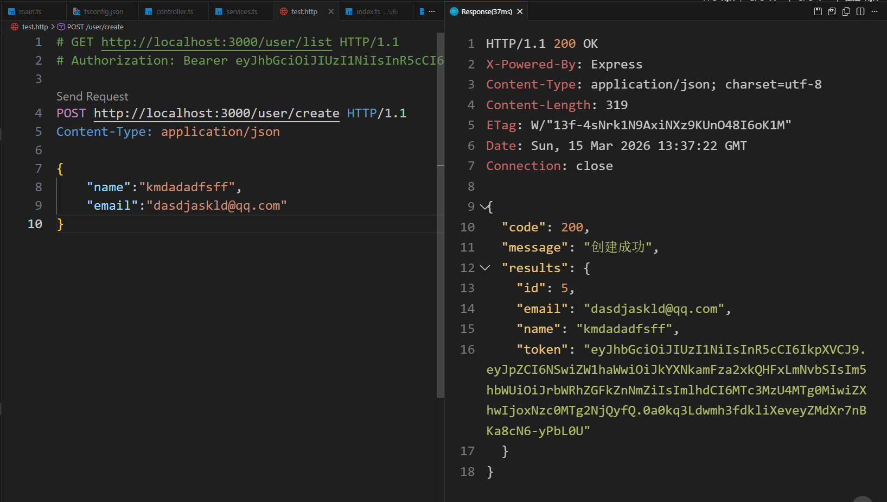
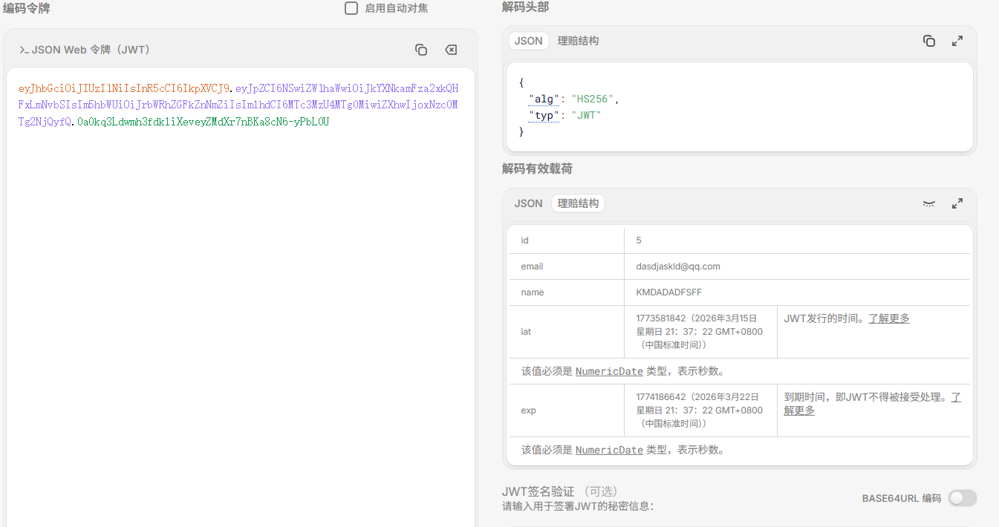
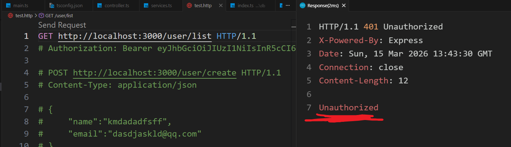
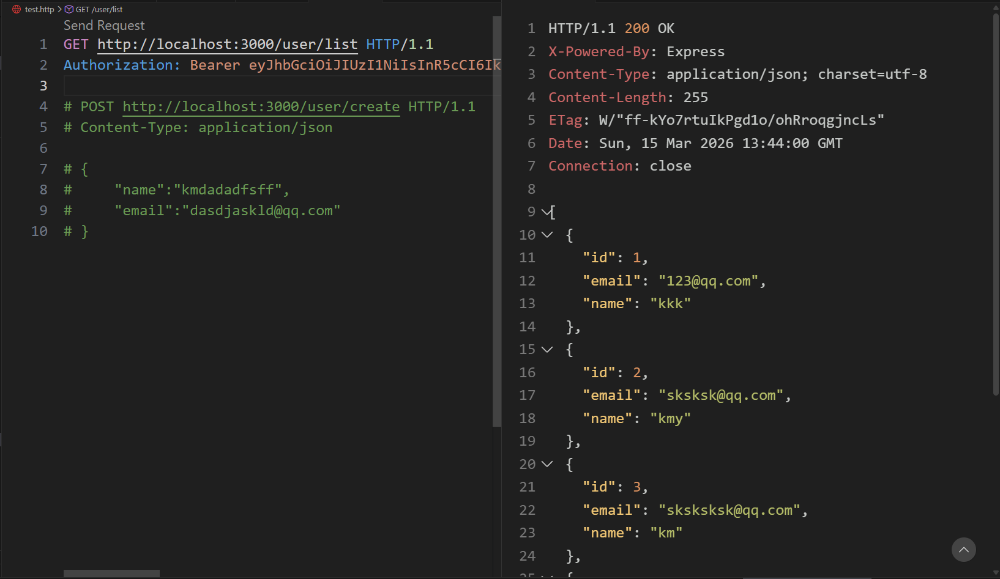

# JWT
jwt就是jsonwebtoken，这个常用来做身份验证。原理就是在发送请求的时候携带一串字符串，如果匹配上了就通过请求，没匹配上就拒绝

jwt由三个部分组成：head头部，payload负载（放一些信息），Signature签名（用来验证的秘密信息）

# 依赖
需要用到的库：
1. `jsonwebtoken` ：用于生成token的
2. `passport` : 用于身份的，注意jwt只是里面的一个验证方式而已
3. `passport-jwt`:包括了验证jwt的一些插件

# JWT类的代码

JWT这个类里面应该有的：

1. 暴露整个类，同时创建一个`createtoken()`的方法用来生成token
2. 和express进行关联
3. strategy() 
4. middleware中间件，这样在别的地方就能进行引用这个方法验证

```ts

import { injectable } from "inversify";
import jsonwebtoken from "jsonwebtoken"
import passport from "passport"
import {Strategy,ExtractJwt} from "passport-jwt" //只是一个插件

//jwt是passport提供的一个鉴权方法

@injectable()
export class JWT {

    private secret = 'kfjr123456'
    private jwtOptions = {
        jwtFromRequest:ExtractJwt.fromAuthHeaderAsBearerToken(),
        secretOrKey:this.secret
    }
    constructor(){

        this.strategy()
    }


    //
    strategy(){
        let str = new Strategy(this.jwtOptions,(payload,done)=>{
            done(null,payload);//这里可以选择路由
        })
        passport.use(str)
    }


    /**
     * 中间件
     */

    public static middleware(){
        //经过这个中间件去验证，这里需要返回一下
        return passport.authenticate('jwt',{session:false})
    }

    /**
     * 1.创建一个token
     */
    public createJWT(data:object){
        return jsonwebtoken.sign(data,this.secret,{expiresIn: '7d'})
    }

    /**
     * 
     * 2跟express关联
     */
    public init(){
        return passport.initialize()
    }
}
```

## main.ts

需要把jwt注入到容器中，同时在中间件里调用JWT里的init方法进行绑定

```ts

container.bind(JWT).to(JWT)   

/**
 * 中间件
 */
server.setConfig((app)=>{
    app.use(express.json())


    //从容器里读出来，在调用这个init关联方法
    app.use(container.get(JWT).init())
})

```

## services
比如在service这里，创建新用户的时候，我想着，直接生成一个token再传给客户端就好了，这样他第一次创建完毕之后，拿到token，接下来需要token的操作就能进行了。所以在向controller返回创建用户的结果的时候，可以顺带着创建token返回

```ts

//所有和数据库的操作都在这一层完成，再将方法暴露出去
import { inject, injectable } from "inversify"
import { PrismaDB } from "../db"
import { UserDto } from "./user.dto";
import { validate } from "class-validator";
import { plainToClass } from "class-transformer";
import { JWT } from "../jwt";


@injectable()
export class UserService {

    constructor(
        @inject(PrismaDB) private readonly PrismaDB: PrismaDB,
        @inject(JWT) private readonly JWT: JWT                   //新增
    ) {

    }


    //比如这里要实现两个方法
    //获取所有用户
    public getList() {
        return this.PrismaDB.prisma.user.findMany(); //一层层的去找，不过为什么要prismaDB这一层？不直接用prisma？
    }

    //创建新用户
    public async createUser(user: UserDto) {
        //校验之前，你要将这个user先按照模板规划好对吧，所以在这，把user给轨道UserDto类里
        let userDto = plainToClass(UserDto, user)
        console.log(userDto);

        const errors = await validate(userDto);
        if (errors.length > 0) {
            console.log('errors:' + errors);

            throw new Error(JSON.stringify(errors));

        } else {
            const results = await this.PrismaDB.prisma.user.create({
                data: userDto
            })
            console.log("走了这里");

            return {
                ...results,
                token:this.JWT.createJWT(results)  //这个传入的results就是那个载荷，里面有用户的信息和jwt信息
            }
        }

    }
}

```


# 发送请求
创建用户发送请求

这样就拿到token了。把这段信息拿去解码

这样就看到了token里携带的信息

# 身份验证
有些路由我们想要携带token才让访问，比如获取用户列表。
---
在controller层可以控制，只需要在这个路由上使用中间件就行

```ts

@GET('/list',JWT.middleware())   //使用中间件函数
    public async getList(req: Request, res: Response) {
        //获取所有用户

        let results = await this.Userservice.getList();

        res.send(results)

    }

```

不携带token试着发送请求


**Unauthorized**
---
使用**Authorization: Bearer 你的token**去发送请求：
