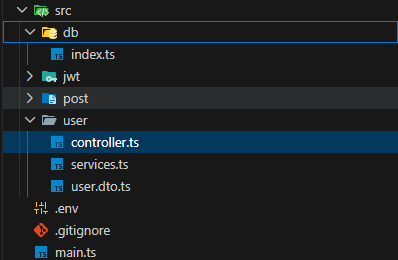

# MySQL+Prisma+项目架构MVC,IoC,DI+JWT

## prisma
Prisma ORM 与 MySQL 快速入门
MySQL 是一种流行的开源关系型数据库。在本指南中，您将学习如何从头开始设置一个 TypeScript 项目，使用 Prisma ORM 将其连接到 MySQL，并生成 Prisma Client，以便轻松、类型安全地访问您的数据库。

安装prisma： [安装prisma](https://prisma.org.cn/docs/getting-started/prisma-orm/quickstart/mysql)

### 碰到一些小问题
1. prisma7之后自动生成了**prisma.config.ts**文件，在这里面和官方的有点不同，需要改成官方的
2. 创建prismaClient实例需要传入adapter配置了，跟着官方就行

## 项目架构MVC,IoC,DI

没看懂，不理解概念，但是有点想法

这里分点讲一下各个地方的内容

1. db，db里面放的是数据库的实例化，就是在这里创建一个操作数据库的类，prisma提供了一个prismaClient的实例对象，这个里面一个是含有操作数据库的方法。这个全部封装到PrismaDB这个类然后暴露出去，在services里面引入，需要使用的时候直接调用方法就行了

```ts
import { PrismaClient } from "../../generated/prisma/client";
import { inject, injectable } from "inversify";

@injectable() //表示可注入的？
export class PrismaDB {
    prisma: PrismaClient;
    constructor(@inject('PrismaClient') PrismaClient: () => PrismaClient) { //这里返回PrismaClient的实例
        this.prisma = PrismaClient();
    }
}
```


2. controller层，这一层是连接服务和services的，有点像路由。感觉流程是服务端express接收到前端的请求后会转发到这里，经由不同的路由，然后controller调用services里的方法，将参数传进services方法，最后让services进行数据库操作

```ts
//这一层可以拿到前端传过来的数据，然后去使用services里的方法
import { controller, httpGet as GET, httpPost as Post } from "inversify-express-utils"
import type { Request, Response } from "express" //从express拿到这个类型
import { inject } from "inversify"
import { UserService } from "./services"


@controller('/user')   //这个有点像之前模块分出来的路由
export class User {

    constructor(@inject(UserService) private readonly Userservice: UserService) {
        //这里传个Userservice是什么意思？
    }

    @GET('/list')
    public async getList(req: Request, res: Response) {
        //获取所有用户

        let results = await this.Userservice.getList();

        res.send(results)

    }

    @Post('/create')
    public async createUser(req: Request, res: Response) {
        // const data = req.body;
        try {
            let results = await this.Userservice.createUser(req.body);
            res.json({
                code: 200,
                message: "创建成功",
                results: results
            })
        } catch (error) {
            res.status(400).json({
            code: 400,
            message: "参数验证失败",
            errors: JSON.parse(error.message) // 或者直接返回 error.message
        });
        }


    }

}
```

3. services层，里面全是封装好的数据库操作，比如查询和创建，调用prisma的方法然后把结果给controller层

```ts
//所有和数据库的操作都在这一层完成，再将方法暴露出去
import { inject, injectable } from "inversify"
import { PrismaDB } from "../db"
import { UserDto } from "./user.dto";
import { validate } from "class-validator";
import { plainToClass } from "class-transformer";


@injectable()
export class UserService {

    constructor(@inject(PrismaDB) private readonly PrismaDB: PrismaDB) {

    }


    //比如这里要实现两个方法
    //获取所有用户
    public getList() {
        return this.PrismaDB.prisma.user.findMany(); //一层层的去找，不过为什么要prismaDB这一层？不直接用prisma？
    }

    //创建新用户
    public async createUser(user: UserDto) {
        //校验之前，你要将这个user先按照模板规划好对吧，所以在这，把user给轨道UserDto类里
        let userDto = plainToClass(UserDto, user)
        console.log(userDto);
        
        const errors = await validate(userDto);
        if (errors.length) {
            console.log('errors:'+errors);
            
            throw new Error(JSON.stringify(errors));
            
        } else {
            const results = await this.PrismaDB.prisma.user.create({
                data: userDto
            })
            console.log("走了这里");
            
            return {
                ...results

            }
        }

    }
}
```

4. dto层，这里做的是一些格式矫正

```ts
//dto层，这一层用来做校验
import { IsNotEmpty,IsEmail} from "class-validator"
import { Transform } from "class-transformer"

export class UserDto {
    
    @IsNotEmpty({message:"名字是必填的"})
    @Transform(({value}) => value.trim())
    name:string


    @IsNotEmpty({message:"邮箱是必填的"})
    @IsEmail({},{message:"邮箱格式不正确"})
    email:string               //注意这里是原始数据类型
}

/**
 * options?: validator.IsEmailOptions, validationOptions?: ValidationOptions
 */
```

5. main，主入口。这里面主要进行了一件事是创建了一个叫container的东西。这个东西可以将很多需要的类绑定在这个container容器上
容器（Inversify）做的事情是集中管理所有模块的依赖关系，让模块之间不直接依赖具体实现，而依赖“抽象”（比如接口或类本身）。
在你现在的项目里：
User（控制器）需要 UserService。
UserService 需要 PrismaDB 和 JWT。
PrismaDB 需要 PrismaClient。
如果用传统方式，你得在 User 里手动 new UserService()，在 UserService 里 new PrismaDB() 和 new JWT()，层层嵌套。这不仅代码耦合，而且测试时很难替换某个模块。
容器解决了这个问题：你把所有类都交给容器，告诉它“某个类依赖什么”，容器在需要的时候自动帮你去创建这些依赖并组装好。

```ts

import "reflect-metadata"
import "dotenv/config"
import { InversifyExpressServer } from "inversify-express-utils" //连接express的
import { Container } from "inversify"  //容器
import { PrismaMariaDb } from "@prisma/adapter-mariadb"
import { PrismaClient } from "./generated/prisma/client"
import { User } from "./src/user/controller"
import { UserService } from "./src/user/services"
import { PrismaDB } from "./src/db"
import express from "express"

const adapter = new PrismaMariaDb({
    host: process.env.DATABASE_HOST,
    user: process.env.DATABASE_USER,
    password: process.env.DATABASE_PASSWORD,
    database: process.env.DATABASE_NAME,
    connectionLimit: 5
})


// const prisma = new PrismaClient({ adapter });

const container = new Container();

/**
 * 注入User、Userservice
 */
container.bind(User).to(User);
container.bind(UserService).to(UserService)

/**
 * 封装prisma然后注入工厂？
 */
container.bind<PrismaClient>('PrismaClient').toFactory(() => {
    return () => {
        return new PrismaClient({ adapter });
    }
})
container.bind(PrismaDB).to(PrismaDB)


const server = new InversifyExpressServer(container);
/**
 * 中间件
 */
server.setConfig((app)=>{
    app.use(express.json())
})
const app = server.build();
app.listen(3000,() => {
    console.log('listen on 3000');
    
})

```


# DI(依赖注入)
例如controller里的类User，需要用到Userservice，之前需要自己创建实例new Userservices,然后再再函数里面使用**this.userservices**。现在使用依赖注入的方式
直接再构造函数里面声明需要这些依赖就行了

```ts
export class User {

    constructor(@inject(UserService) private readonly Userservice: UserService) {
        //这里传个Userservice是什么意思？
    }
}

```

在这之后就能直接使用UserService了

# 以下ai

# inject和injectable
inject和injectable是来干啥的
## @injectable()

这个装饰器告诉 Inversify：“这个类可以被注入到容器中，也可以被其他类注入”。也就是把这个类标记为“可被容器管理的类”。

```ts
@injectable()
export class UserService {

    constructor(@inject(PrismaDB) private readonly PrismaDB: PrismaDB) {

    }

}
```

这表示**UserService**是可以注入到其他类里，比如**User**，
也可以被注入 **@inject(PrismaDB) private readonly PrismaDB: PrismaDB**


## @inject()

这个装饰器用在构造函数参数上，明确告诉 Inversify：“这个参数需要容器帮我注入某个依赖”。通常配合类型标识符使用（可以是字符串、Symbol 或类本身）。

```ts
constructor(@inject(UserService) private readonly Userservice: UserService) {
        //这里传个Userservice是什么意思？
    }
```

注入**UserService**

# container.bind().to()

那么为什么这个就不需要实例化了呢？还是说实例化在后面
在main.ts里将很多东西**container.bind().to()**

例如 `container.bind(PrismaDB).to(PrismaDB)`

1. container.bind(PrismaDB)
bind 方法开始一个绑定声明，参数 PrismaDB 是服务标识符（通常是一个类、字符串或 Symbol）。它返回一个 BindingToSyntax 对象，用于进一步配置如何解析该服务。

2. .to(PrismaDB)
.to() 指定了具体实现：当容器需要提供 PrismaDB 时，应该实例化 PrismaDB 这个类。

因为服务标识符和实现类是同一个，所以写成 .to(PrismaDB)。你也可以绑定不同的类，比如 `container.bind<Logger>(TYPES.Logger).to(ConsoleLogger)`。

3. 实例什么时候被创建？

实例的创建发生在解析依赖的时候，也就是当容器被要求获取该服务时。

例如：

在另一个类的构造函数中通过 @inject(PrismaDB) private prismaDB: PrismaDB 声明依赖，当容器创建该类实例时，会自动调用 container.get(PrismaDB) 来获取 PrismaDB 实例。

或者你显式调用 container.get(PrismaDB) 也会触发实例化。

实例化时，容器会检查 PrismaDB 的构造函数是否有其他依赖，如果有，会递归创建它们，然后组装好返回。