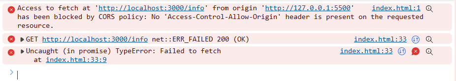
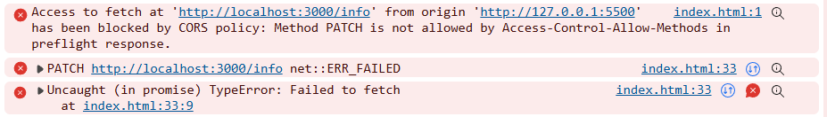
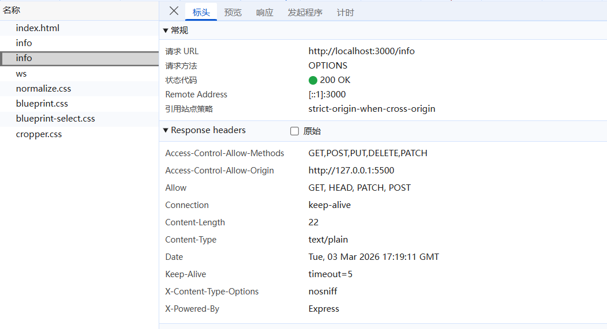
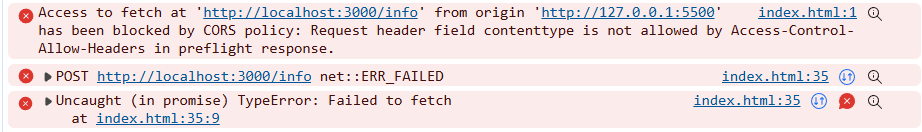
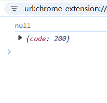

# 响应头和请求头

## 响应头
响应头是用来干什么的？
* 响应头是在发起http请求的时候，带上的具有特性的信息，以键值对的方式出现
``` 响应头示例
accept-ranges:bytes
cache-control:public, max-age=0
connection:keep-alive
content-length:2831
content-type:text/html; charset=UTF-8
```

## 响应头和跨域
什么是跨域CORS？因为浏览器存在着同源策略，所以当发起请求的时候，浏览器会根据同源策略进行限制
**同源策略：协议域名端口号必须相同才能通信**

* 这里使用express起一个简单的服务：
```
app.get('/info', (req, res) => {
    res.json({
        code: 200
    })
})
```
* 前端使用fetch发送请求
```
fetch('http://localhost:3000/info').then(res=>res.json()).then(res=>{
            console.log(res);
            
        })
```
诶，可以看到这里显示了跨域错误，因为我们的域名和端口号都不一样，由于这是前后端分离的项目，所以这里的端口号肯定是不能重复的。localhost和127.0.0.1虽然域名不同，但是转换一下会发现也是不行的


### 解决跨域问题
这里我们使用express的use去起一个中间件：
```
app.use((req,res,next)=>{
    res.setHeader('Access-Control-Allow-Origin','*') 
    next()
})
```
请求在进来之后，都要先进入这个中间件处理。在这里设置一个响应头**Access-Control-Allow-Origin**，值设置成 * 。*表示通配符，这样设置之后，所有请求都能获得回应。所以一般我们设置特定的地址，仅仅让这些地址能跨域
```
app.use((req,res,next)=>{
    res.setHeader('Access-Control-Allow-Origin','http://127.0.0.1:5500') 
    next()
})
```
这样就只有我们http://127.0.0.1:5500的请求能请求到数据了

## 请求方法导致的跨域问题
我们服务端默认只支持 GET POST HEAD OPTIONS 请求，例如我们遵循restFui 要支持PATCH 或者其他请求
```
fetch('http://localhost:3000/info',{
            method:'PATCH'
        }).then(res=>res.json()).then(res=>{
            console.log(res);
            
        })
```

服务端也起一个接口：
```
app.patch('/info', (req, res) => {
    res.json({
        code: 200,
        type: 'patch'
    })
})
```

发生了错误：


**Method PATCH is not allowed by Access-Control-Allow-Methods in preflight response.**
这说明patch不在方法里面
设置里面加上这个就行了
```
res.setHeader('Access-Control-Allow-Methods','GET,POST,PUT,DELETE,PATCH')
```

## 预检请求
预检请求是用来对请求做预检的，比如检查你有没有跨域，有的话请求都不用执行，直接404
三种情况会有预检：
1. POST PATCH DELETE这些非简单方法发起请求
2. 自定义了请求头部，就是定义了不属于默认的请求头的时候
3. 带凭证的请求：当请求需要在跨域环境下发送和接收凭证（例如包含 cookies、HTTP 认证等凭证信息）时，浏览器会发送预检请求。

### 非简单方法发起请求
刚刚发送的PATCH请求就能看到预检请求



### 自定义了请求头部的预检
在这里发送一个POST请求
```
fetch('http://localhost:3000/info', {
            method: 'POST',
            headers: {
                'Content-Type': 'application/json'
            }, body: JSON.stringify({
                name: 'kfjr'
            })
        }).then(res => res.json()).then(res => {
            console.log(res);

        })
```
先还没看到预检，看到报错了

**Request header field contenttype is not allowed by Access-Control-Allow-Headers in preflight response**
* 这个请求头没有包含在Access-Control-Allow-Headers中，这里说明，不是所有的请求头都是符合预设的，请求头后面再说
将content-type加入
```
app.use((req,res,next)=>{
    res.setHeader('Access-Control-Allow-Origin','http://127.0.0.1:5500') 
    res.setHeader('Access-Control-Allow-Methods','GET,POST,PUT,DELETE,PATCH') 
    res.setHeader('Access-Control-Allow-Headers','Content-Type') //这里加上Content-Type，允许客户端发送JSON数据
    next()
})
```
可以看到这里也起了预检请求

## 请求头
默认情况下cors仅支持客户端向服务器发送如下九个请求头
1. Accept：指定客户端能够处理的内容类型。
2. Accept-Language：指定客户端偏好的自然语言。
3. Content-Language：指定请求或响应实体的自然语言。
4. Content-Type：指定请求或响应实体的媒体类型。
5. DNT (Do Not Track)：指示客户端不希望被跟踪。
6. Origin：指示请求的源（协议、域名和端口）。
7. User-Agent：包含发起请求的用户代理的信息。
8. Referer：指示当前请求的源 URL。
9. Content-type: application/x-www-form-urlencoded | multipart/form-data |  text/plain
那你看这里是没有 `application/json`的，所以刚才我们在客户端发送这个的时候，需要在服务端设置


## 自定义响应头
后端起一个get接口：
```
app.get('/info', (req, res) => {
    res.set('kfjr','ymk');
    res.json({
        code: 200
    })
})
```
设置了一个响应头：**'kfjr'：'ymk'**

客户端打印一下：
```
fetch('http://localhost:3000/info').then(res => {
            const headers = res.headers;
            console.log(headers.get('kfjr'));
            return res.json();
        }).then(res => {
            console.log(res);

        })
```

会发现，打印出来的是null，这是因为自定义响应头想要被获取到必须在服务端设置暴露
```
app.get('/info', (req, res) => {
    res.set('kfjr','ymk');
    res.setHeader('Access-Control-Expose-Headers','kfjr') //抛出这个自定义的响应头
    res.json({
        code: 200
    })
})
```
这样就拿到了