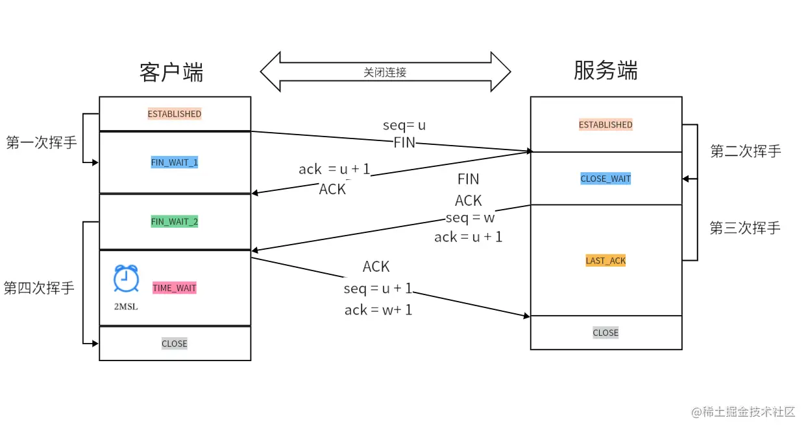

# TCP三次握手
SYN：发起新连接
Seq：序列号，随机生成
Ack：确认号：ack= Seq+1
ACK：确认序列号有效的标识
FIN：结束
一次握手：客户端发送SYN和客户端Seq   [SYN]，发送了客户端Seq
二次握手：服务端生成服务端Seq，服务端确认号Ack=客户端Seq+1,确认有效发送ACK   [SYN,ACK]，发送了服务端Seq
三次握手：客户端发送二次Seq = 客户端Seq + 1，客户端发送客户端Ack = 服务端Seq+1   [ACK],再次确认了序列号有效

# TCP四次挥手  

客户端和服务端都可以主动断开连接，以客户端为例
1.客户端发送FIN包和生成的客户端Seq序列号，进入wait_1状态
2.服务端发送确认号Ack = 客户端Seq + 1，验证成功发送ACK，客户端进入wait_2状态，客户端进入wait_2状态后会等待未结束的请求结束，服务端还能发送未完成的数据
3.之前的请求结束之后，服务端进入最后确认，服务端生成服务端Seq序列号，并且再次发送确认号Ack=客户端Seq + 1确认，这是第三次挥手
4.客户端收到后进入time_wait超时等待，发送Seq和ack验证之后，服务端接收完毕就断开连接，这里超时等待的目的是让服务器能收到ACK包，ACK包丢失之后可以再发送。如果没有等待时间，服务器收不到ACK包，就永远不会断开连接