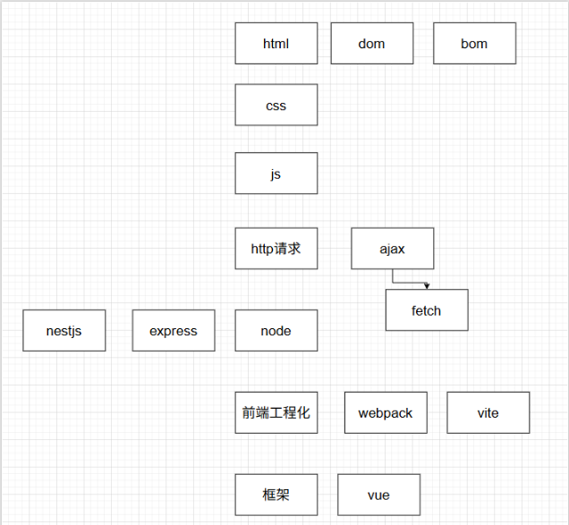

# 2026/4/12

前几天把node的作业交掉了，接着是前端工程化，我不太用的来这个前端工程化。然后其实node也有些东西没有学的很好。但是今天想来了了这个学到的东西在我脑子里面的构建，感觉有点乱

这里面有相当多东西没有列举出来，这是因为学的不太好或者已经忘记了

## 我脑子里的东西

HTML是一个骨架，或者说是一个树干，这里面包括着很多个分叉，节点。这就是dom元素了，dom做的就是把这些html标签做成一个树去构建起来

接着就是css，css是一个画师，给标签上色和调节大小，还可以做动画 ，这个东西我感觉的更多是有趣

js，js像是一个手，用来操作这个dom树了，可以干的事情就相当多了，我的页面有了互动，我可以动态的插入 li div 等等东西，第一次实用的感觉类比是：我可以在我的页面上发评论了。我的页面不是一开始就写死了，有了js我可以动态的操作

然后就是请求，就是请求数据,第一次使用是原生的模拟b站时候，要实现一个滚动加载功能，我用的是原生的ajax向后端发送请求。这个请求里面包含了图片的url，让我能给它一起拼接到我的html里面。就是我的图片资源是放在前端的，加不加载它是看有没有用到这个url

请求之后学到的是一个从url里面读取参数的功能，点进每个页面要不一样的东西，第一次用到了动态参数param这个东起。我只要在url后面加上不同的id   [:id] 就可以拿到不同的配置，我可以给它设置好多套对应的视频和标题还有up主

接下来就是ajax和fetch、axios、promise  我第一次接触到了异步编程的概念但是有点晕，说实话我现在也没太学会。总之js是单线程的，如果发送请求，页面就会一直等待这个请求直到它完成

然后是node，node里面学了express和nestjs，前者让我处理前端的请求更加简单，后者让我知道作为框架应该考虑规范的事情

接下来是前端工程化，我其实不知道这个概念，但是了解了打包的概念。打包的感觉就是把所有的东西打包起来，减少了发请求的数量，然后了解了树摇，这个东西就是优化你的代码吧，有些东西你引用了但是没有使用，打包之后就给你直接删掉了。结果一看工程化的作业之类的。天，感觉我啥也没学到的感觉

然后下午看了下vue  。 之前我在vue的官方那里使用了一下，以为这个vue啊，就是靠这个ref响应式出名的，现在我看了下视频。发现他不是由组合式作为核心思想啊，我还不太了解。但是可能是我心态还是啥有点问题，感觉我少学了好多东西，在这看的老吃力了

## 

html写骨架+css绘画+js交互+请求数据+打包  然后还有部署这里也是不知道，有个想法倒是做个日记app出来（因为手机上的app太击败多广告了）

感觉还得多拿点时间来学啊，而且我也一致在想着一个事，就是我这水平，学到暑假能不能找到实习，毕竟现在大三下了，还完全不知道往后是什么流程

我的天，这两天都不是很想学啊，提提劲