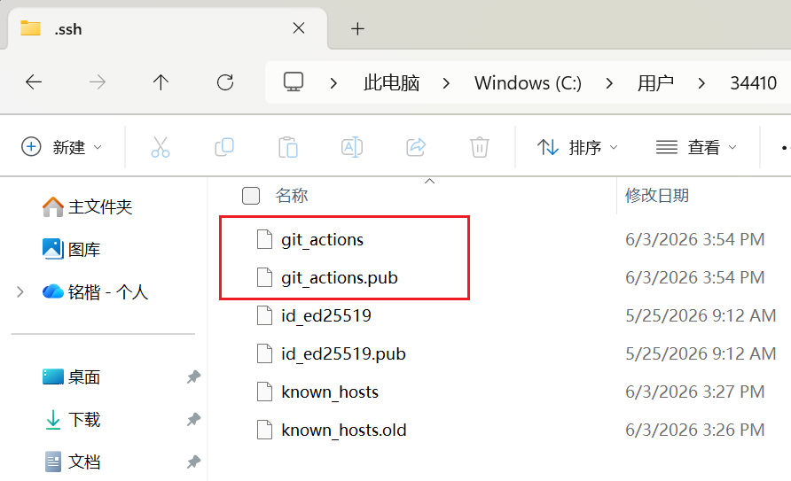
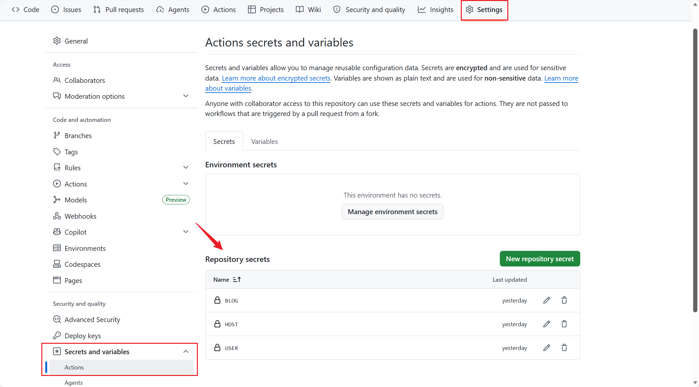
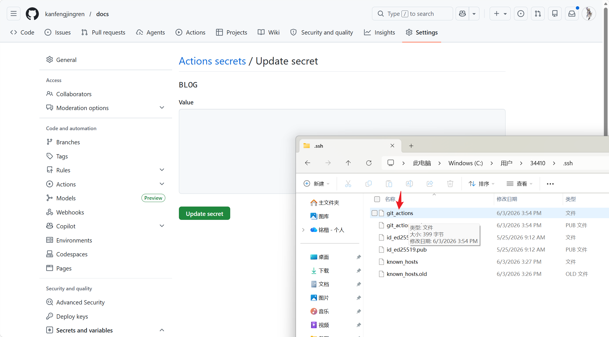
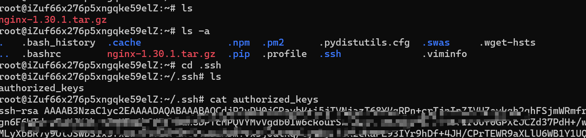
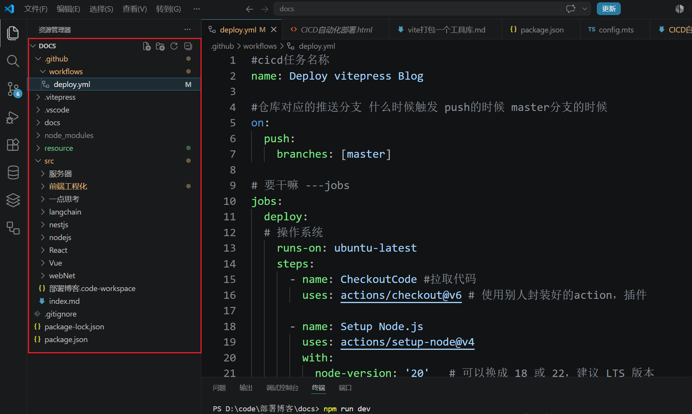

# 简易的CI/CD

CI是自动提交的意思，CD是自动部署的意思。以前多人合作的时候，提交合并代码间隔比较长，而且也比较麻烦，然后有了CI，帮你自动提交。CD就是通过一套流程帮你把项目部署到服务器上

## 使用git action来做这个CI/CD

因为这个博客是提交到git上的，然后就使用gitaction来走这套流程了

## 流程

一开始我想复杂了
1. push代码到git
2. git把代码推送到服务器上让他同步
3. 服务器自动打包
4. 配置nginx代理，部署打包后的产物

诶！现在发现，其实流程应该是这样：
1. push提交到git
2. git帮我打包好
3. 直接发送打包后的文件到服务器不就好了，甚至也不用重新配置nginx，因为nginx配置好一次之后，会实时监测部署的文件夹

## 动手！

所以就是三个端的链接：**电脑---git---云服务器**。主要的其实是git和云服务器的链接

### 准备配置git和云服务器的链接

1. 设置密钥：
```sh
ssh-keygen -t ed25519 -C "git_actions" -f C:\Users\33410\.ssh\git_actions
```
一路回车就会生成密钥，这个密钥是用来链接github和远程服务器的

没带pub的是私钥，带了pub的是公钥

2. github里设置信息：
在远程仓库里找到setting，里面的secret，在这里新建三个信息，比如这里，我设置了三个，分别是用于链接的私钥BLOG，远程服务器的地址POST，在服务器上执行操作的角色user也就是root

私钥BLOG里面填的是上一步生成的私钥,把里面的东西复制进去就行了


3. 登录服务器，粘贴公钥，准备链接：
登录服务器后，在root下新建 **.ssh** 文件夹。复制公钥的内容（就是生成的带了pub的那个文件）。执行命令,表示将公钥写入 **authorized_keys** 文件中
```sh
echo "你复制的公钥内容" >> ~/.ssh/authorized_keys
```
最后，配置一下权限，输入`chmod 700 ~/.ssh` 和 `chmod 600 ~/.ssh/authorized_keys` 指令。


### 写脚本

你的项目根目录下新建一个 .github/workflows/deploy.yml 这个脚本是用yml文件写的
所以你的目录结构大概是这样：


#### 动手！

```yaml
#cicd任务名称
name: Deploy vitepress Blog

#仓库对应的推送分支 什么时候触发 push的时候 master分支的时候
on:
  push:
    branches: [master]

# 要干嘛 ---jobs
jobs:
  deploy:
  # 操作系统
    runs-on: ubuntu-latest
    steps:
      - name: CheckoutCode #拉取代码
        uses: actions/checkout@v6 # 使用别人封装好的action，相当于插件

      - name: Setup Node.js  
        uses: actions/setup-node@v4
        with:
          node-version: '20'   # 可以换成 18 或 22，建议 LTS 版本

      - name: Install dependencies
        run: npm ci

      # 打包
      - name: Build VitePress site
        run: npm run build

      # 将构建好的 docs 目录同步到你的服务器
      - name: Deploy to Server
        uses: burnett01/rsync-deployments@6.0.0
        with:
          switches: -avzr --delete
          path: docs/                 # 上传到git上的 outDir 是 docs，且位于根目录
          remote_path: "/home/usr/docs"  #服务器上的位置
          remote_host: ${{ secrets.HOST }}    #前面自己设置好的密钥、服务器ip、角色
          remote_user: ${{ secrets.USER }}
          remote_key: ${{ secrets.BLOG }}
      

```

就是一个简单的流程：上传之后，打包，然后推送。先在服务器创建对应的文件夹。然后将整个项目push到git仓库中，gitaction就会开始执行


