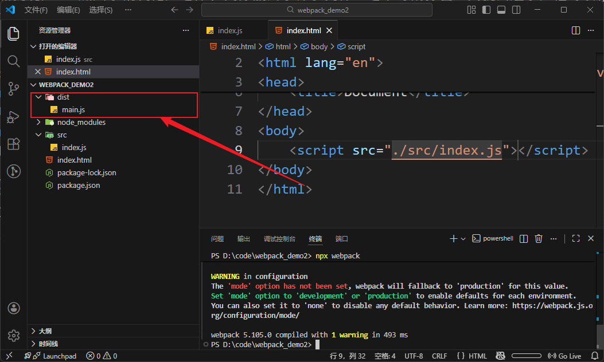
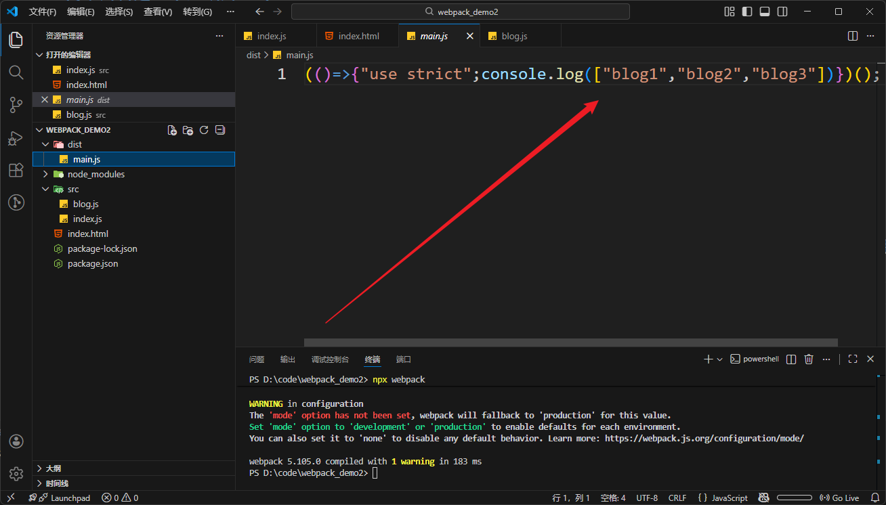
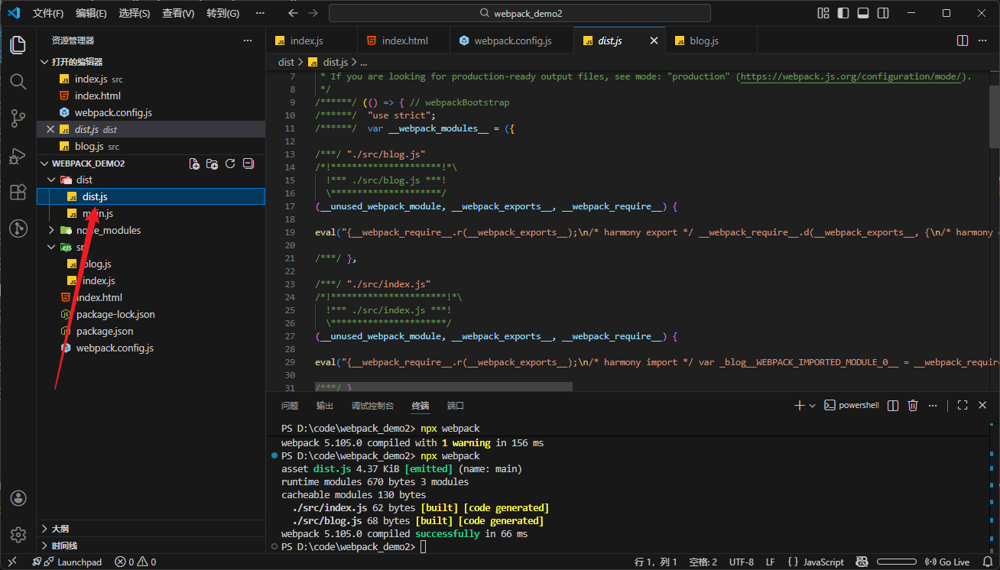
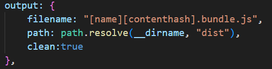

# Webpack基础
学东西之前，我一直都很想知道，这个东西可以用来干什么，然后再去学这个东西怎么用。现在js和请求大致学完了，可以做一些简单的网页，马上就要学框架。中间插入打包工具，我在想这个东西是用来干什么的？
## 是用来做什么的？
在开发的时候，会有html、css、js等等文件，还有图片和文本等等文件，这些文件非常分散。同时呢，为了防止命名冲突和 让js代码更加美观，ES6加入了模块化，这样js又分散出了许多文件。这个时候打包工具就出选了，他可以帮我们把这些静态文件全部打包到一个静态文件夹中

# 简单的构建一个基础的webpack
webpack是依赖于nodejs的
## npm init -y
初始化项目
## npm add webpack webpack-cli --dev
添加webpack工具，dev指将这些依赖安装到开发者依赖中

## npx webpack

创建好js和html文件之后，直接打包一下试试

可以看到，有了一个dist目录，同时下面多了一个main.js,里面就是打包好的js代码。因为js代码没有涉及引用，此时dist里面的js代码和原来的是一致的
我们尝试着使用一个导入的js，看看会怎么样

代码直接被智能简化成了直接打印！

## webpack.config.js  开始配置webpack
可以开始配置webpack，指定打包的文件入口和出口等等

新建一个文件**webpack.config.js**,然后开始配置
```
const path = require('path')

module.exports = {
    mode:"development",
    entry:"./src/index.js",
    output:{
        filename:"dist.js",
        path: path.resolve(__dirname,"dist")
    }
}
```
*mode*用于设置为开发者依赖，*entry*表示打包的入口文件。*output*包括俩：1、**filename**：打包后的文件名；2、**path**：打包后的文件地址。这里地址使用了nodejs力的path，所以需要导入一下

再次`npx webpack`<br>


## 使用加载器（Loaders）加载css文件
Webpack 本身只能处理JavaScript，但是通过加载器，它可以处理其他类型的文件，比如CSS、图片、字体等。例如，你可以用css-loader和style-loader来处理CSS，用file-loader来处理图片。

### 不使用Loaders，直接打包试试
可以发现失败了

### 安装loaders   npm add --dev style-loader css-loader
安装好了之后进行配置
```
module:{
        rules:[
            {
                test:/\.css$/i,
                use:["style-loader","css-loader"]
            }
        ]
    }
```

**rules**配置下，**test**用来匹配所有符合名称的文件，**use**里包含着需要使用到的加载器

再次打包，成功
* module loader 可以链式调用。链中的每个 loader 都将对资源进行转换，不过链会逆序执行。第一个 loader 将其结果（被转换后的资源）传递给下一个 loader，依此类推。最后，webpack 期望链中的最后的 loader 返回 JavaScript。

请确保 loader 的先后顺序：'style-loader' 在前，而 'css-loader' 在后。如果不遵守此约定，webpack 可能会抛出错误。

## 为图片资源进行配置
在src下创建assets/image文件并导入图片。同时也需要将图片用导入的方式导入到index.js中
再在rules中配置
```
{
    test:/\.(png)|(jpg)|(gif)$/i,
    type:"asset/resource
}
```
再次打包，打开网页，图片资源正确加载了！


## 在webpack中使用插件并且配置
现在我们还是使用src里面的html，但是我们也能借助webpack提供的插件来将html打包，现在我来演示一遍
安装插件：`npm install --save-dev html-webpack-plugin`
接着在webpack配置文件中配置插件：
1.首先导入插件`const HtmlWebpackPlugin = require('html-webpack-plugin');`
2.plugins是一个数组，你可以在里面配置插件
```
plugins: [
    new HtmlWebpackPlugin({
      title: '管理输出',
    }),
  ],
```
3.再次打包，可以看到*dist*文件夹下多出了**index.html**，webpack帮我们打包好了，而且title是管理输出

## 文件的命名
现在我们打包后的文件，修改前和修改后都是一个名称，这样可能有一个问题。一个文件，上传给浏览器之后，我修改再打包后上传给浏览器，浏览器可能认为是同一个文件没有修改，转而去使用缓存中的上一个资源。为了解决我们可以动态的解决这个问题。
---
对输出进行一些修改，将output里的文件名改成这样：`filename: "[name][contenthash].bundle.js"`
打包后应该能看到新的文件

这里我们看到，对一个index.js文件进行修改，两次打包后的hash值是不同的。旧的那一版不要可以删除，同时在output里面有着指令可以自动清除
在output中加入指令：`clean:true`
结构应该是这样的：



